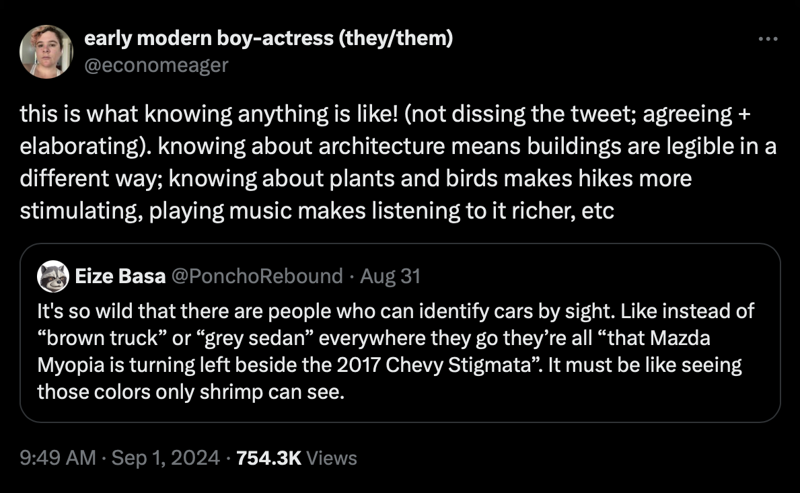

This is from [a tweet](https://x.com/economeager/status/1830271859671327153): knowing about architecture means buildings are legible in a different way; knowing about plants and birds makes hikes more stimulating, playing music makes listening to it richer, etc.

However, it clicks with me from another perspective. To understand or to know the world better, we have to know some details and have to know it in one abstracted way. Yes, the world (so vast and so long) to us (so tiny so short) is always abstracted one way or another. For example, the capitalism is an abstracted construct in the real world. Sometimes, we know it. Sometimes we know its name only. Sometimes we do not know its name yet but just feel its existance like the elephant to the blind.

The screenshot of the original tweet is .
  
