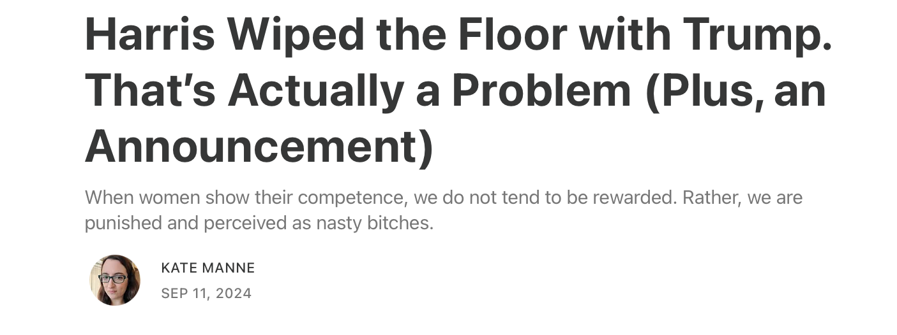
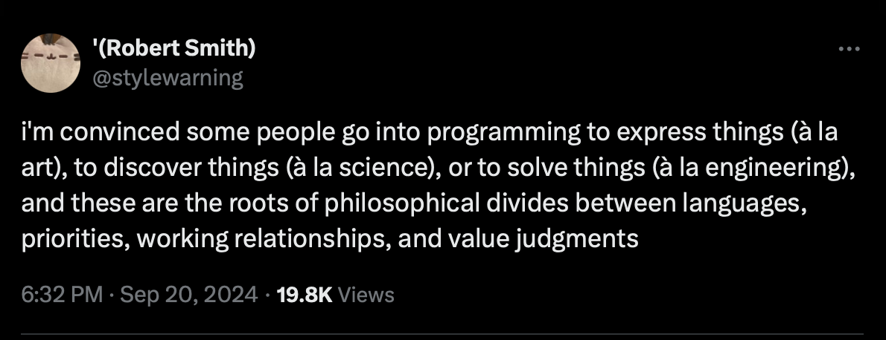

Hope it will be proved wrong in the due time. The source is from [Kate Manne](https://substack.com/@katemanne/p-148785044).

Three types of programming:

## PS 2024-10-06

it is a year now. the longer the war by Isreal, the less chance of Harris to win. it is unfortunate but that is exactly what Democratic Party is doing now. then it will blame voters for its failure. The Hamas attack last year is terrorism. The war in Gaza by Isreal is genocide.  
