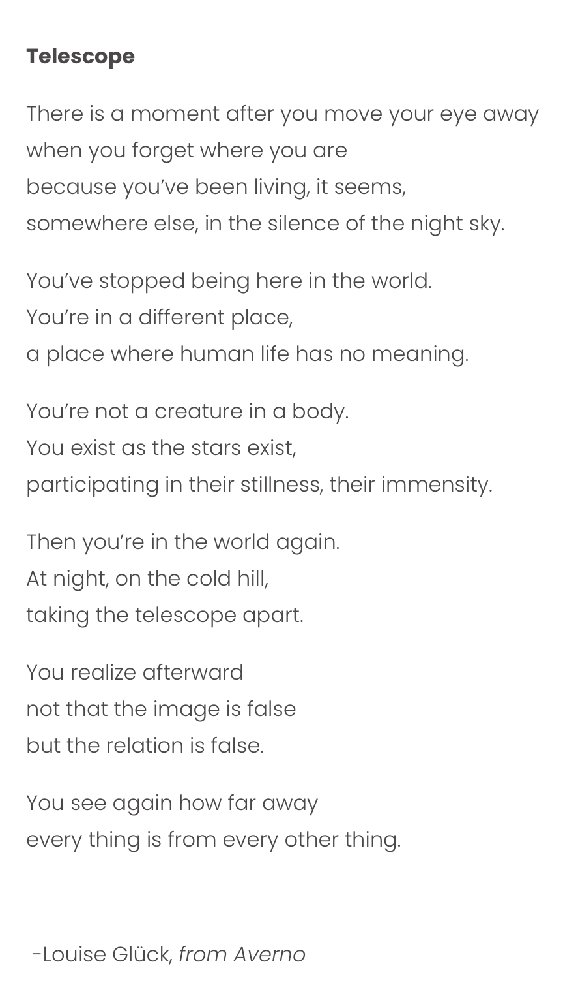

We don’t see things as they are, we see them as we are.

```
A mind not to be changed by place or time.
The mind is its own place, and in itself
Can make a heav’n of hell, a hell of heav’n.

John Milton (1608-1674), Paradise Lost
```

```
In books we never find anything but ourselves. 
Strangely enough, that always gives us great pleasure, 
and we say the author is a genius. 

— Thomas Mann
```


