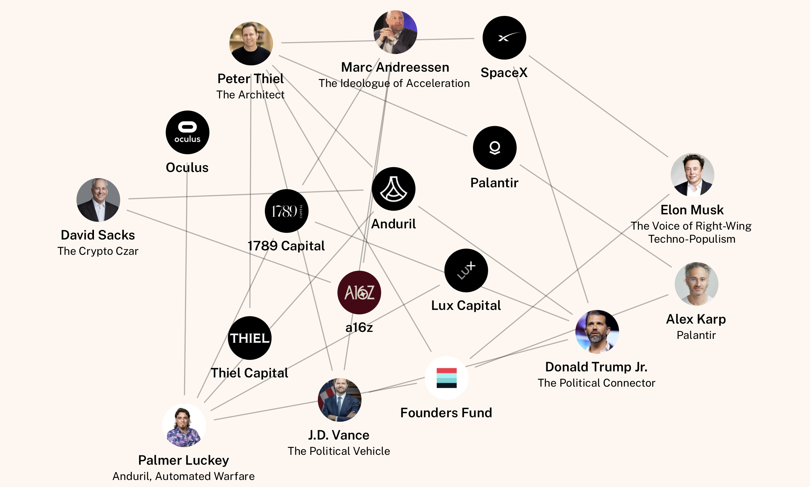

> Albert Camus: **Fiction is the lie through which we tell the truth.**

## [Peter Coviello: Maybe don't talk to the New York Times about Zohran Mamdani](https://lithub.com/maybe-dont-talk-to-the-new-york-times-about-zohran-mamdani/)

> For some time I’ve been saying that the storied choice between socialism and barbarism was made exquisitely clear a good many years ago in the United States, and both major parties chose barbarism. They are obviously and consequentially different barbarisms — one had reproductive freedom, vaccines, and trans health care in it, at least for a while — and I can tell you why I have sincerely preferred one to the other. But we oughtn’t to kid ourselves. From the perspective of a world of increasingly unimaginable maldistribution of resources, cascading ecological collapse, a genocide cheered on by a putatively liberal order, **both are barbarisms.** Mamdani seemed to me a small glimmering break in the wall of all that. A part of me wanted to do him a solid.

> I read it over now with this kind of full-spectrum cringe of the spirit. It’s the rattle of a person going on and professorially on, quite as if the substance of a discipline, or its intellectual trajectory, or even just the nourishing joy of sustained and serious study, mattered at all to the person he was talking to, or to the majestic institution he represents. And honestly, what could be more feeble?

> It’s not that those things don’t matter: they absolutely goddamn do, and will keep on mattering, and I wouldn’t go on with the whole tedious business of teaching if I thought otherwise. **It’s just that they never mattered much to the Times** and they are, to appearances, mattering less and less by the day. I should remember that, and so should you.

* Peter Coviello is professor of English at the University of Illinois-Chicago. He has written about the history of sexuality, queer children, pop songs, nineteenth-century American literature, Mormon polygamy, step-parenthood, and much besides. In 2017-18, he was on fellowship at the Institute for Advanced Study in Princeton. His newest book, "Long Players: A Love Story in Eighteen Songs," will appear from Penguin Books in June of 2018.

* [Wussy, Teenage Wasteland, Live on KEXP](https://www.youtube.com/watch?v=8xsgu7mSIOk)

## [the authoritarian stack](https://www.authoritarian-stack.info/)

## Twin Peaks: the return

> Norma: I gave them all my exact recipes, as per our agreement, but I don't think they are following them.

> Walter: Norma, I assure you they are following your recipes to the letter, but also per the agreement, using their discretion about where they get the ingredients.

> Norma: No. All my ingredients are natural, organic, local.

> Walter: I know. You make them with "love".

> Walter: Norma, you are a real artist. But love doesn't always turn a **profit**. We believe in you 100%, but from a business perspective the board would like you to consider some alternatives without sacrificing any of the high standards you're so well known for.

* the end result is more expensive products of lower quality for profit only. But the capital chasing profit is not new. **Making Quick Money and short-term exploitation** are also not new for private equities.

* Megan Greenwell, Bad Company: Private equity and the death of the American Dream, 2025

  * [2025June05 book excerpt: How private equity helped destroy local news](https://www.rollingstone.com/culture/culture-features/private-equity-destroys-america-1235348956/)

  * [2023June02: Days of plunder](https://prospect.org/2023/06/02/2023-06-02-days-of-plunder-morgenson-rosner-ballou-review/)

  * book: Brendan Ballou, Plunder: private equity's plan to pillage America
 
  * Book: Gretchen Morgenson, These are the plunderers

  * [world after capital](https://github.com/WorldAfterCapital/WorldAfterCapital)
  
  * Technological progress has shifted scarcity for humanity. When we were foragers, food was scarce. During the agrarian age, it was land. Following the industrial revolution, capital became scarce. With digital technologies scarcity is shifting from capital to attention. World After Capital suggests ways to expand economic, informational and psychological freedom to go from an industrial to a knowledge society.

## [use value vs exchange value](https://www.metafilter.com/86891/The-Plague-of-Free#2836285)

so the use value for air is very high, without air we would not be able to breathe. but air's economic value is low, because no one as yet has figured out a way to ration air to individuals. because of its commodity status air is freely shared despite its clear value.

however, in an environment where air is scarce, such as underwater or outer space, the control of air is much easier to regulate. those who own the compressors, tanks and regulators (infrastructure) to deliver air to paying customers are able to derive economic value from what nominally is a ubiquitous and free resource.

the same reasoning behind use and economic value can be applied to IP. control of IP in the past was relatively straightforward given the use value of IP was limited in scope to those who had the necessary infrastructure in place to utilize it. in the music industry, recording and selling songs were a function of owning the distribution rights and the facilities to mint IP onto vinyl, tape, CD or whatever media format desired.

high capital costs were a deterrent for widespread multiplication of IP and hence supply was relatively easy to regulate, copyrights enforced and economic value maintained. but with widespread and low cost availability of equipment to record and exhibit all sorts of media, even marginal consumers are now able to gain access to IP (and even produce it), rendering those types of IP essentially free.

the important thing to recognize is how amenable IP is to commodification. given use value for a specified market, if the IP represents a complicated process that only companies with large resources are able to replicate, then its economic value is easily defended. but if fixed and marginal costs to replication are low, the ability to defend IP declines, whether through legal enforcement or otherwise. it becomes like air.

* Book: Marshall Berman, All that is solid melts into air: the experience of modernity, 1988

## DC Sandwich Guy

> On Monday (Nov 3, 2025), jury selection began in the trial of Sean Dunn, a former paralegal for the Department of Justice, charged with a misdemeanor for throwing a salami submarine sandwich “at point blank range” at a federal agent after a grand jury refused to authorize felony charges. As former federal prosecutor Joyce White Vance noted, prosecuting this case while dismissing others—like the issue of border czar Tom Homan allegedly accepting $50,000 to steer contracts toward a certain firm—diminishes the public’s confidence in the Justice Department. The case also made the administration seem like a joke as a federal agent wearing a bulletproof vest tried to claim a sandwich that remained intact in its wrapper “exploded” against his chest. Punsters had a field day all week. This afternoon (Nov 6, 2025), the jury acquitted Dunn.

## evolution: from machine code to AI

AI will be a great tool for programmers and laymen. Just think about the low-level programming at the very start in assembly language and C. Then C++ and Java brought the object for abstraction. think in objects. Soon frameworks and libraries appear, and several cloud providers such as AWS, Google Cloud, and Azure and APIs for better and ready services. Now we have AI-helper.

If you look at the compilers, its output or target moves from machine assembly to intermediate representation. LLVM is basically compiler-as-libraries. 

* [compilers](https://abhinavsarkar.net/notes/2025-compiler-backend-survey/)  

* [the tinkering of Robert Noyce](https://web.stanford.edu/class/e145/2007_fall/materials/noyce.html)

## notes

As I grow up the world becomes more hopeless. All news are bad so i need constant distraction to focus on doing something. When I pause to think about, the world is the same all the time while I could see it more directly and clearly. I no longer claim that I know the world like when I was young. I am still wrong about the world but in somewhere deeper level.

