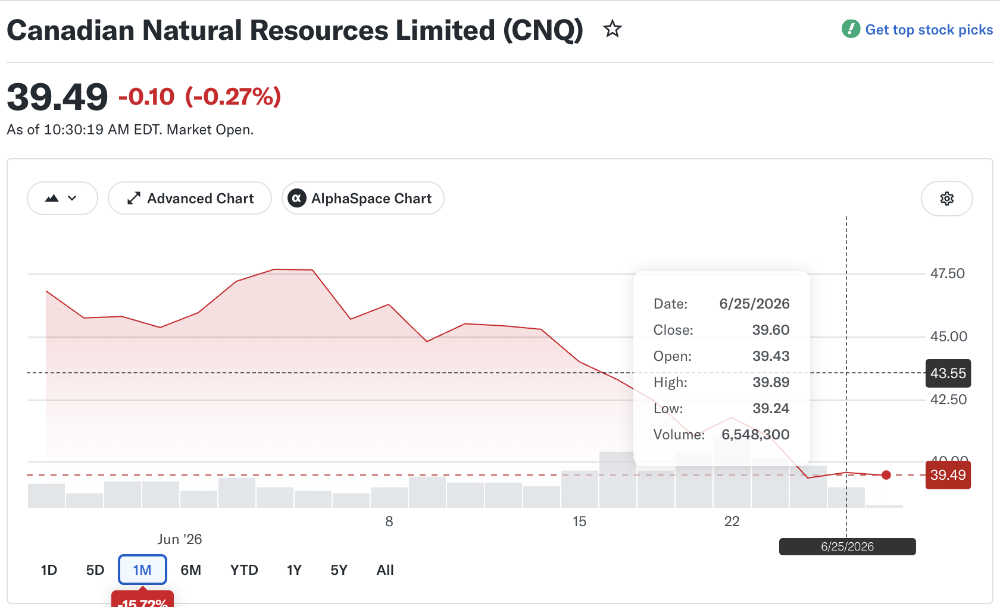
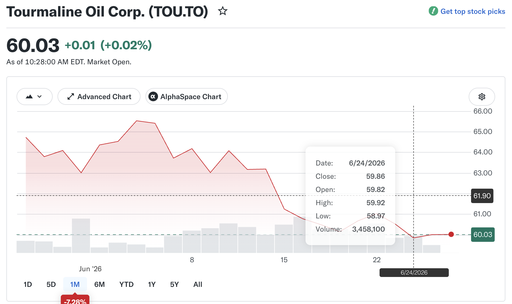
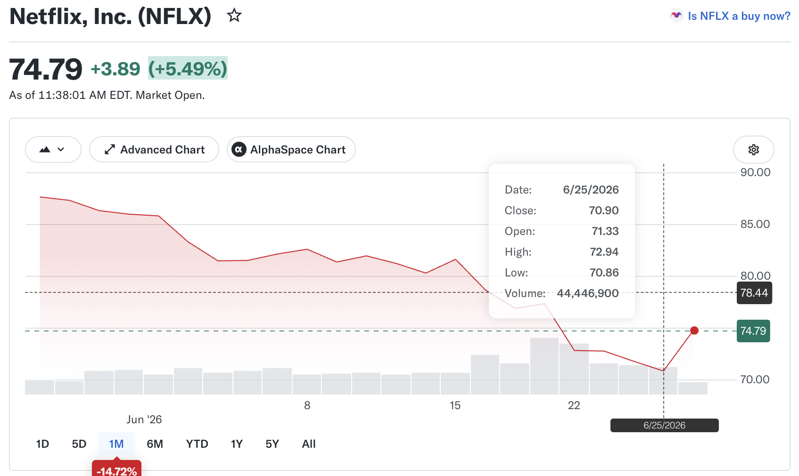
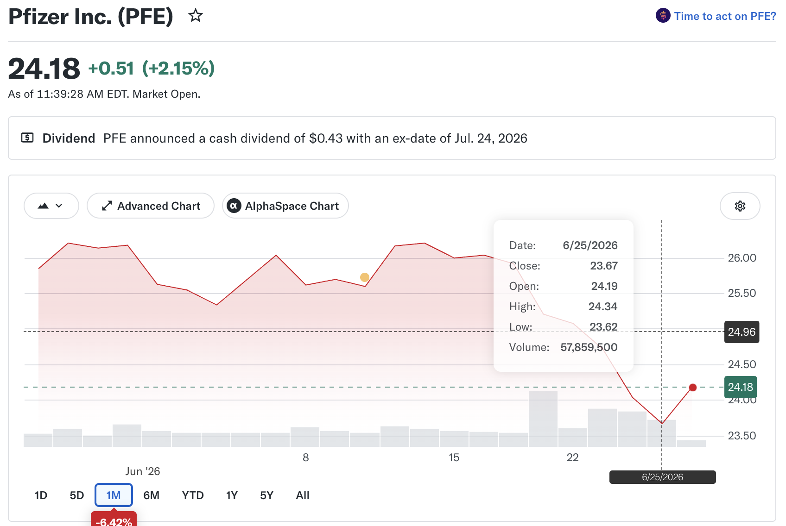
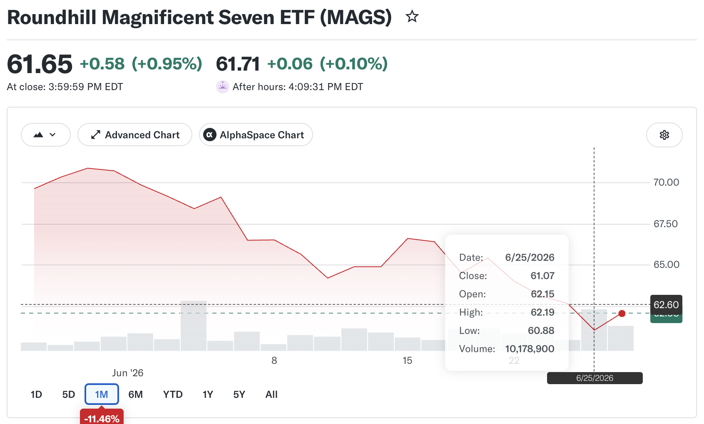
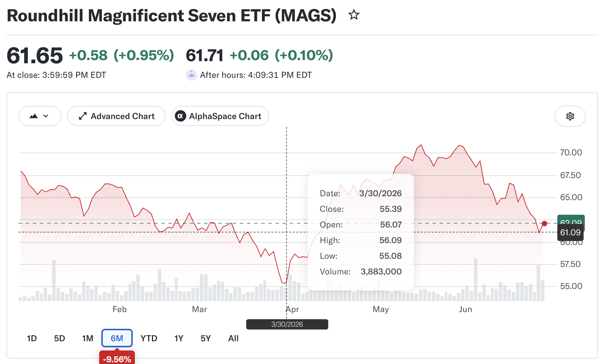
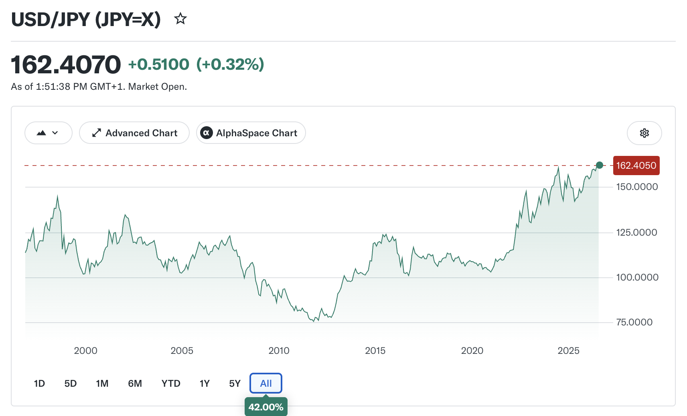

> "Political language... is designed to make lies sound truthful and murder respectable, and to give an appearance of solidity to pure wind." -- George Orwell

> "If you want a vision of the future, imagine a boot stamping on a human face." -- George Orwell, 1984 

> "Obedience is not enough. Unless he is suffering, how can you be sure that he is obeying your will and not his own? Power is in inflicting pain and humiliation. Power is in tearing human minds to pieces and putting them together again in new shapes of your own choosing." -- George Orwell, 1984

> “The trouble with having an open mind, of course, is that people will insist on coming along and trying to put things in it.” -― Terry Pratchett, Diggers

> "No... Humans need fantasy to be human. To be the place where the falling angel meets the rising ape." -- Terry Pratchett

> “Happiness is always a by-product. It is probably a matter of temperament, and for anything I know it may be glandular. But it is not something that can be demanded from life, and if you are not happy you had better stop worrying about it and see what treasures you can pluck from your own brand of unhappiness.” -- Robertson Davies, The Enthusiasms of Robertson Davies

### [Kant and Hume by Emily Fitton](https://blog.apaonline.org/2025/04/09/kant-vs-hume-can-we-access-reality/)

> David Hume and Immanuel Kant were almost contemporaries, but they reached radically different conclusions on the nature of reality and our ability, or lack thereof, to access it. Hume cast doubt on humans’ ability to ever really know the reasons or fundamental truths behind our experience. Kant, in response, proposed a revolution in our understanding of our relationships to ourselves and to the outside world, and in doing so offered a way to maintain knowledge of the physical world.

> The concept of causality (that some event, x, is directly responsible for some other event, y) might seem so integral to our experience of the world that it is difficult to imagine a world without it. But when we try to point to something in experience that makes a series of events causal, this something remains elusive. We can’t see the causal relationship itself, but only two events: one that we take to be the cause and the other that we take to be the effect.

> It’s true that we could point to the fact that certain events are usually or always followed by certain other events. But causality is something more than this: there is a sense that when one event happens, the other is in some way inevitable, and that the first event is the reason for the second. So where does this concept come from? Hume proposes that it is a product of psychological processes: If we experience event A followed by event B enough times, we will begin to expect event B whenever we encounter event A. It is this feeling of expectation that forms the basis of the concept of causality.

> But this presents us with a problem. If the concept of causality were something that we could arrive at through logic alone, then we could make some sense of its relationship to real objects in the physical world: logic arguably provides us with some direct access to objects because it establishes what is and isn’t possible. Alternatively, if we believed that causality could be directly perceived in objects, then it is clear to see how the concept might resemble the world as it really is. But if the origin of a concept is psychological, we have no way of knowing whether it bears any resemblance to the world as it really is. In fact, more than that, it is difficult to imagine how it could.

> In the Critique of Pure Reason, Kant borrows some terminology from law to help him to distinguish between two kinds of questions. A quaestio facti (“question of fact”) is the kind of question that in law might be answered by a jury; it is about gathering evidence to draw conclusions about the world. The more evidence we gather, the more confident we can be in our conclusions. A quaestio juris (“question of law”), on the other hand, is the kind of question that’s answered by a judge. Its subject matter is much less tangible: supposing the facts alleged are true, what laws apply? Importantly, the way of answering these two questions is fundamentally different. No amount of examining the facts of the case can, on its own, tell the judge which laws apply. Instead, they must attempt to interpret the law to establish under what circumstances it might apply.

> So why draw our attention to this distinction? Kant thinks that it provides a useful framework for thinking about the kind of questions that Hume poses: questions that relate to our knowledge of the external world. There are a set of questions, analogous to the quaestio facti, that have to do with matters of fact in the physical world. These are the kinds of questions that can be answered by science.

> But there is a separate set of questions, analogous to the quaestio juris. These questions have to do with the legitimacy of certain concepts (our “right” to apply them to objects), especially where there is nothing obvious that we can point to in experience to distinguish cases where the concept applies and cases where it doesn’t. By way of example, Kant points to the concept of “fate”. The idea that there is some greater plan behind events in the world is not uncommon, yet there doesn’t seem to be any perceptible difference between a world that’s governed by fate and a world that’s not. We might ask “quid juris?” about this concept—“what right” do we have to use it?

> If we fail to satisfy the quaestio juris, the skepticism that results is very different from the skepticism that results from a failure to satisfy the quaestio facti. It’s not just that we can’t be confident in our use of a concept: we have no justification for using the concept at all. Hume’s concerns about whether the concept of causality can apply to objects in the physical world, given its apparent psychological origins, transforms the nature of his investigation from a quaestio facti into a kind of quaestio juris.

> But Kant points out that the division is also not an “in itself” or something that we have immediate access to: it, too, must be constructed. And if we know the principles through which it is constructed, then we can know something about the outer world. It’s true that the object that we know doesn’t exist entirely independently of this framework. But neither is it a product of the inner self as the skeptic imagines, since the inner self comes about only through this process of division. A successful transcendental argument establishes that the concept in question applies to objects in the physical world because it’s somehow intrinsic to this framework of knower and objective world to be known.

> Kant argues that the concept of causality is necessary to distinguish a world that changes—a world extended in time. Our perceptions are in constant flux, yet we only attribute some of this to changes in the object we are perceiving. The rest, we attribute to a change in ourselves, or our perspective. On what basis do we make this distinction? Kant argues that we take change to be objective—something happening in the object we’re observing—when we think that there’s something necessary about the order of our experiences. As a tree grows, for example, my perceptions of it are necessarily ordered from small to large. But if a tree appears smaller as I move away from it, I don’t think that the tree itself has changed: the tree could just as easily increase in size again once I move closer to it. In other words, it is in some sense the irreversibility of experiences that determines a real change in the physical world. Kant thinks that this irreversibility is what underpins our concept of causality.

> In a strange way, then, we come full circle: by taking the skeptic’s premise to its logical conclusion, Kant arrives at a radical kind of realism about the physical world: existence or objective reality is already necessarily governed by the concepts and principles that make the distinction between inner and outer sense—subjective experience and an objective world—possible at all. If it were not, then we would not be in a position to encounter it. In fact, Kant thinks that we would not be in a position to encounter ourselves.

> So why should we care about all of this? Whether or not we accept Kant’s position on causality, the distinction he draws between quaestio juris and quaestio facti is helpful in avoiding all kinds of intellectual knots. For the vast majority of questions we have about the external world, we can get by without ever thinking about the quaestio juris. The world already does exist, and our job is usually to try to make sense of it as it is.

> But the enormous success of the scientific method can make it tempting to treat every problem as though it were a quaestio facti—to expect, in other words, that science should be able to provide an exhaustive explanation of reality, including the framework of science itself. The result of this can be skepticism: when it becomes clear that science can’t explain how mind and world could coincide, it can be tempting to conclude that they don’t, or at least that there is no way that we can know that they do. Kant’s attempt to respond to the quaestio juris shows us at least the possibility of an explanatory power external to, yet consistent with, science.

> There are also implications for what it means to have, or to be, a mind. The “hard problem of consciousness” arises in part because we take the distinction between subjectivity and objectivity, mind and world, to be primary, and then attempt to explain one in terms of the other. The Kantian position recognizes the distinction as emergent and so allows for alternative conceptions of the relationship. What Kant offers us is not just a response to skepticism, but a profound reorientation. Instead of seeing mind and world as separate realms in need of a bridge, conceptual understanding is itself the process through which reality becomes articulated into both self and world.

### investing

* 20260625 (Thursday)

there are moments or periods when the mode of investing is changing. for example, after the peace negoriation started last week (MOU signed that Thursday) and the debut of Walsh's first Fed meeting, the hawkish mode was coming. the anticipation of stronger dollar leads the price of gold down (now hovering aroun $4,000). due to the stop of Iran war, the oil price is down for sure and the stock prices of many oil companies. however the inflation is still high and the odd of rate hike is higher. then people start the reckoning of AI bubble. One example is that MU (micron) is up about 17% pre-market and changed to up 10% after opening and 17% up again due to the very good quarterly report. SpaceX (SPCX) is back to around its debut price of $150. Now the price of Apple stock is down 6% to $274 after announcing price hike. That is rare for Apple. this is the continuition of tech sell-off since this Tuesday. so I called this period of **mode transition**. all the participants are re-evaluating the stock price of AI-related companies, oil-related company, and many others. Be cautious during this kind of transition in mode switching. 

* 20260626 (Friday):



> CNQ is falling after the Iran peace negotiation since last week. On 2026-06-24, there is a recent low point of US$39.02.



> Tourmaline is falling too but not that dramastically as CNQ. It has a recent low of C$58.97 on 2026-06-24.


> Wendy is becoming a Meme stock now.



> Netflix has a recent low of US$70.86.



> Pfizer has a recent low of US$23.62.







### [Anthony Burgess, 1917-1993](https://en.wikipedia.org/wiki/Anthony_Burgess) and his novel A Clockwork Orange (1962)

* [the international Anthony Burgess foundation](https://www.anthonyburgess.org)

> “The important thing is moral choice. Evil has to exist along with good, in order that moral choice may operate. Life is sustained by the grinding opposition of moral entities.” -- Anthony Burgess, A Clockwork Orange

> “It is as inhuman to be totally good as it is to be totally evil.” -- Anthony Burgess, A Clockwork Orange

> “Language exists less to record the actual than to liberate the imagination.” -- Anthony Burgess

> “Art is dangerous. It is one of the attractions, when it ceases to be dangerous you don't want it.” ―- Anthony Burgess

* munificence: the quality or action of being extremely generous

* [Russell Harty interviews Anthony Burgess in 1974, youtube](https://www.youtube.com/watch?v=vESghBLHUac):

> All I mean by original sin is that History shows us that given an opportunity to do good or to do evil, men will usually do evil. And it's no good blaming it on other people... to show what people are really like. That we're prone to evil... (after his first wife was mugged by four Amrican soldiers and died after during World War II) but it is a fact that however we pretend that life is all roses and honey, life can be pretty evil on occasions, and it's no good blaming anybody except man himself. We're all like that. Given the chance, we'll all be like that.

> History shows that given an opportunity, man will do evil. Man goes on doing evil, and our problem is to learn how to live with it. It's not to pretend that there are solutions. There's no political solution, there's no moral solution. 

> A model citizen by being brainwashed and by being made sick by being made nauseous by the very thought of eveil. This is the state taking over. If the state did take over, and the state can take over, God knows, then we would have a beautiful society in which nobody could do wrong. But if a man cannot do wrong, he cannot do good. Because good is defined in terms of wrong, and wrong is defined in terms of good. It's a matter of choice. Good and evil are opposite. Good and evil are a pair. They, in a sense, are locked together. If we're incapable of doing evil, we're incapable of doing good, because good is only defined in terms of evil... England, my own country, has opted for neutrality. We sit back and wait for things happen. We don't think that we ourselves have any responsibility to make things happen. We think it's a prerogative of the economists or the politicians who are straw men... politicians have proved that they have no answers to the problems we're going through, either the moral problems, the problems of inflation. therefore the answers to these problems must lie somewhere in the individual mind. Must lie in me, in you, in everybody.

> abstract party programs, abstract political terms. so easy, so simple, (but not right) history proves, our own experience proves, makes no difference to the actual situation. 

> If this is so, we all have intellects. We're all the same. the choice is always ours. It is no good our pretending that the priviledge of thought is given to others not to ourselves. we ourselves have the right and moreover the duty to decide things for ourselves. This we're unwilling to do.

### [why is it so hard to be ordinary? by Joshua Rothman, May 22, 2026, New Yorker](https://archive.ph/Fa2V6)

* compete to be excellent? **Society** as a whole is shaped by the relentless pursuit of excellence in every domain. is it the only problem in capitalism? did it happen before capitalism? If the problem is more, then it is a problem of desire and ambition. Then it's a problem of human nature over a very long time. More is overrated and enough is underrated all the time.

* simply as a matter of statistics, the extraordinary is rare. in the book of The Overseer Class, that is simply "first something" such as first black president and so on.

* "that takes our talents and turns them into a desire to win our spot at the top of competitive hierarchies.” This tendency is “at the heart of much that is wrong in our world.” 

* the desire to be exceptional, or “great,” has been replaced with the aim of being “good enough.” A good-enough life, in Alpert’s view, is characterized by “decency and sufficiency.” It incorporates the idea of limitation—both in the sense that we’re all limited, and in the sense that others’ limitations are opportunities for mutual aid and connection. 

* many people haven't internalized the concept of diminishing marginal utility/returns. but capitalism needs people to be dissatisfied, insecure and chasing the new hotness.

* the diseased principles of maximal efficiency and maximal profit. but we are finite, right? 无为? we have to enjoy what we are doing, so that we could be good enough. Or it is miserable? "the survival of the fittest" rather than the survival of the fitter. But I don't think that success need be defined as being better than your neighbour: good enough is good enough.

* There's a lot of joy in finding peace in having enough. From the Tao Te Ching:There is no greater calamity than not knowing contentment. There is no greater fault than the desire for gain. 

> “知人者智，自知者明；胜人者有力，自胜者强。知足者富。强行者有志。不失其所者久，死而不亡者寿。” 《道德经》第三十三章

> “名與身孰親﹖身與貨孰多﹖得與亡孰病﹖是故甚愛必大費，多藏必厚亡，知足不辱，知止不殆，可以長久。” 《道德经》第四十四章

> “禍莫大於不知足；咎莫大於欲得。故知足之足，常足矣。” 《道德经》第四十六章

* one poem 

```
When things are troublesome, always remember,
keep an even mind, and in prosperity
be careful of too much happiness:
since my Dellius, you’re destined to die,
whether you live a life that’s always sad,
or reclining, privately, on distant lawns,
in one long holiday, take delight
in drinking your vintage Falernian.
Why do tall pines, and white poplars, love to merge
their branches in the hospitable shadows?
Why do the rushing waters labour
to hurry along down the winding rivers?
Tell them to bring us the wine, and the perfume,
and all-too-brief petals of lovely roses,
while the world, and the years, and the dark
threads of the three fatal sisters allow.
You’ll leave behind all those meadows you purchased,
your house, your estate, yellow Tiber washes,
you’ll leave them behind, your heir will own
those towering riches you’ve piled so high.
Whether you’re rich, of old Inachus’s line,
or live beneath the sky, a pauper, blessed with
humble birth, it makes no difference:
you’ll be pitiless Orcus’s victim.
We’re all being driven to a single end,
all our lots are tossed in the urn, and, sooner
or later, they’ll emerge, and seat us
in Charon’s boat for eternal exile.

One Ending, Ovid
```

* Book: Fifth Business by [Robertson Davies, 1913-1995, canadian novelist](https://en.wikipedia.org/wiki/Robertson_Davies)

> Who are you? Where do you fit into poetry and myth? Do you know who I think you are, Ramsay? I think you are Fifth Business. You don't know what that is? Well, in opera in a permanent company of the kind we keep up in Europe you must have a prima donna -- always a soprano, always the heroine, often a fool; and a tenor who always plays the lover to her; and then you must have a contralto, who is a rival to the soprano, or a sorceress or something; and a basso, who is the villain or the rival or whatever threatens the tenor.

> So far, so good. But you cannot make a plot work without another man, and he is usually a baritone, and he is called in the profession Fifth Business, because he is the odd man out, the person who has no opposite of the other sex. And you must have Fifth Business because he is the one who knows the secret of the hero's birth, or comes to the assistance of the heroine when she thinks all is lost, or keeps the hermitess in her cell, or may even be the cause of somebody's death if that is part of the plot. The prima donna and the tenor, the contralto and the basso, get all the best music and do all the spectacular things, but you cannot manage the plot without Fifth Business! It is not spectacular, but it is a good line of work, I can tell you, and those who play it sometimes have a career that outlasts the golden voices. Are you Fifth Business? You had better find out.

* book: Amil Niazi’s Life After Ambition: A “Good Enough” Memoir

* [in praise of leisure](https://www.laphamsquarterly.org/roundtable/praise-leisure)

### [Tolkien lecture: On Fantasy by Brandon Sanderson](https://www.brandonsanderson.com/blogs/blog/on-fantasy-tolkien-lecture-oxford-2026)

* [lecture recording](https://tolkienlecture.org/2026/06/19/on-fantasy-by-brandon-sanderson-lecture-recording/)

fantasy is a fiction. fantasy is about impossible. Fantasy uses fantasy aethetic. portal fantasy. heoric fantasy. epic fantasy.

22 minutes

* innovation 4: stakes

> Stakes aren’t enough to make a story work; it must be stakes mixed with a personal relationship with the characters living them.

> A story is only as thrilling as our worry for the people in it, and a magic is only as intriguing as our curiosity about how it affects people we love. Gollum is, in this, one of the most important people in the whole story—because he let us see the conflict between honor and greed on an individual level. Will be become the person Frodo sees in him, or will be become the person the ring wants? Likewise, the stakes of a world ending only work because we care, and we cry, and we hurt as Sam carries Frodo up the mountain.  

> Epic fantasy is, then, a conundrum. It is a story where often the entire world is threatened, but we can’t care about that as much as we care about a gardener who just wants to go home. As stated by folklorist Jack Zipes, “In fantasy, the little person is raised to the position of God.” 

* innovation 5: immersion

> Many of the pre-Tolkien secondary world fantasies read this way; like a stroll through a portal fantasy, merely without the portal.

> We can all agree that Middle-earth is different. It reads not as a whimsical adventure and more a serious historical record from a world that never actually existed. Part of this is the use of ephemera; the first thing you see when opening the Hobbit, for example, is a map—not just any map, the exact map used in the book, by the characters. 

* In “On Fairy-Stories,” Tolkien talks about three key emotions that come from reading the fantastical: Recovery, Escape, and Consolation. He talks at length in interesting ways about these ideas, and so of course I encourage you to read the essay itself. In short, one core idea of these three is that these stories help us see the world anew. To recover our view of reality, and the inherent wonder in it. 

* Why fantasy? Why do people love this genre so much? Why does it get its hooks in us, inspire us, stay with us? It’s been a hundred years, almost, since Tolkien wrote his famous line about a Hobbit in a hole. Why are we still celebrating what he created with such lively enthusiasm? 

* My first answer to this is simple: Why art at all? Why Starry Night? Why Clair De Lune? Can’t a thing simply be beautiful, and that is the reason?  

* Still, I strive for something more, though I know I cannot answer their question, not fully. Because I can’t speak for a genre, or for art itself. In the end, all I can do is attempt to explain, in the smallest part, why I love fantasy. 

> As a person ages, I like to think they understand that definitions, like people, are fuzzy things, resisting attempts to lock them down. Words, like swords, get worn down over time, the edges resharpened until their shape sometimes only resembles the original forged creation.  

> Imagining the world as different from the way it is now is, after a fashion, a fiction.  We live in the real world, as it exists, no matter how much we dream of a different one. And yet, we dream anyway. Because if the world is to change, if tomorrow is going to be a better version of today, that starts with imagination.  

In the books I read as a young man, same as the books I read today, I learn about the world. More importantly, I learn about people—how they feel, think, dream, and love. Fantasy isn’t about the past, no more than science fiction is about the future.  These books are about learning the minds and hearts of other people. Moreover, fantasy novels are about challenging and improving the reader’s imagination.  

And so these books provide two simple goods we could desperately use more of today. Empathy. And hope. 

Why fantasy? Because every good thing in the world starts as a fantasy, at some point. Then we dream it into reality. Fantasy is the genre of the impossible, I still insist.

But the people it inspires are exquisitely real. 

### some writers

* [Becky Chambers, 1985-, American science fiction writer](https://en.wikipedia.org/wiki/Becky_Chambers): To be taught, if fortunate (2019), A Psalm for the wild-built (2021)

* [C. J. Cherryh, 1942-, American writer, speculative fiction](https://en.wikipedia.org/wiki/C._J._Cherryh): Downbelow Station (1981), Cyteen (1988)

* Tom Robbins

* David Mitchell

* [Haruki Murakami 村上春樹, 1949](https://en.wikipedia.org/wiki/Haruki_Murakami)

* Kurt Vonnegut

* [Richard Flanagan, 1961-, Australia writer](https://en.wikipedia.org/wiki/Richard_Flanagan): The narrow road to the deep north, 2014

* [Joseph Heller, 1923-1999, Catch-22](https://en.wikipedia.org/wiki/Joseph_Heller): 

* Angela Jones, Sex in Public: The Transformative Social Power of Our Erotic Lives, 2026

* Margaret Attwood

* [Nadine Gordimer, 1923-2014, South African, Nobel 1991](https://en.wikipedia.org/wiki/Nadine_Gordimer)

* [Adrian Tchaikovsky, 1972-, British fantasy and science fiction writer](https://en.wikipedia.org/wiki/Adrian_Tchaikovsky): Children of Time, 2015

* John Steinbeck, The Grapes of wrath

* [France Inter Paris radio](https://www.radiofrance.fr/fip)

* [LoveFIP](https://lovefip.wordpress.com)

* [France Musique](https://www.radiofrance.fr/francemusique)

* [radio france](https://www.radiofrance.fr/franceculture)

* [KEXP online radio](https://www.kexp.org)

### records

| t | sales | date |
| - | ----- | ---- |
| wb | 74 | 2026-06-30 |
| nw | 71 | 2026-06-30 |
| nd | 57 | 2026-06-30 |
| so | 13 | 2026-06-30 |
| a2p | 0 | 2026-06-30 |
| ok | 0 | 2026-06-30 |
  
### notes

* [Anji Bridge, 安济桥,595-605](https://en.wikipedia.org/wiki/Anji_Bridge): 赵州桥, 1950年代翻修焕然一新.

* 1986年的5月9日，以纪念“国际和平年”为宗旨的中国百名歌星演唱会在北京工人体育馆举行，当时名不见经传的崔健穿着一件大长褂子，背着一把吉他，两裤脚一高一低地跑到了简陋的舞台上，吼出了他那首中国摇滚作品的开山之作——《一无所有》，从此，中国的摇滚乐开始了它的艰难之旅。

* [W·B·Yeats 叶芝（1865—1939](https://en.wikipedia.org/wiki/W._B._Yeats）

> 虽然枝条很多，根却只有一条；/穿过我青春的所有说谎的日子/我在阳光下抖掉我的枝叶花朵；/现在我可以枯萎而进入真理. 《随时间而来的智慧》

> 袁可嘉等人主编的《外国现代派作品选》卞之琳、穆旦、袁可嘉、王佐良、杨牧等前辈诗人

> 卞之琳《长时间沉默以后》（“身体的衰老是智慧，年纪轻轻，／我们当时相爱而实在无知”
 
* [J.R.R. Tolkien lecture: On Fantasy by Brandon Sanderson](https://tolkienlecture.org/2026/06/19/on-fantasy-by-brandon-sanderson-lecture-recording/)

> [metafilter imagined as fiction, presented as fiction, and accepted as fiction](https://www.metafilter.com/213647/Imagined-as-fiction-presented-as-fiction-and-accepted-as-fiction)

* [Russell Harty interviews Anthony Burgess in 1974: Anthony Burgess on his A Clockwork Orange, Youtube](https://www.youtube.com/watch?v=vESghBLHUac)

* [the pillars of the earth, historical novel by Welsh author Ken Follett, 1989](https://en.wikipedia.org/wiki/The_Pillars_of_the_Earth)

* [Waveshare ESP32-S3-RLCD-4.2 + Solar OS](https://github.com/nilseuropa/solar_os)


* The Making of a Story: A Norton Guide To Creative Writing, by Alice LaPlante

> Flannery O'Connor said that a good story "resisted paraphrase," by which she meant that a simple summary of a plot or story line would not have the same emotional impact as the whole story... To understand what she means, think about trying to paraphrase, or describe, a Chopin sonata without actually playing any music. It simply cannot be done. The music stands for itself. Nothing can substitute for it with the same effect-not the notes on the page, not a verbal description of the melody and harmony, not even a playing of a simplified version of the main theme. This is also true of the kind of fiction and creative nonfiction we are trying to write: simply stating what the piece "is about" should not be able to convey the complexity and subtlety of the piece as a whole. Some essential mystery, or emotional subtlety, will be lost in the paraphrase.
 
* [SMPTE standards](https://www.smpte.org) are free.

> SMPTE stands for Society of Motion Picture and Television Engineers

* imperfection is the heart of perfection

> [the illusion of culinary precision](https://iza.ac/posts/2026/06/intuitive-cooking/): To someone already anxious in the kitchen, a recipe that refuses to give you exact measurements is daunting. Because I couldn’t always measure her ingredients for her, she had no choice but to learn how to feel them. Week after week, we would mix the dough together. She learned to add a handful of flour, knead, and wait for that specific, tacky resistance. She learned the rhythmic, meditative motions of a six-strand plait (“end to the center, replace with the second-from-the-end on the other side” we would repeat together). I came to deeply love making challah with her, watching her gradually realize that she didn’t need a rigid recipe to make something delicious. **This philosophy — trusting your senses over a strict set of instructions — extends far beyond the oven. It is the core of how we actually cook.** A recipe is a wonderful place to start. But eventually, you have to close the laptop, put your hands in the flour, and see how it feels.

> In traditional Japanese aesthetics, [wabi-sabi (侘び寂び) ](https://en.wikipedia.org/wiki/Wabi-sabi) centers on the acceptance of transience and imperfection.[2] It is often described as the appreciation of beauty that is "imperfect, impermanent, and incomplete".

* [mastodon Natasha](https://tech.lgbt/@Natasha_Jay)

* BASIC09 front-end for LLVM

* VL53L9CX: 54x42 pixel  ToF sensor with about 9m range in SMD package.

* [Rumi's circle: translating rumi](https://rumiscircle.com/translating-rumi/)

* [image matter: add a frame to a picture in Python](https://github.com/DrCuff/ImageMatter)

* [Lore: EpicGames open source version control, binary too](https://github.com/EpicGames/lore)
 
* 增长率能反映出他们是否做出了正确的产品。the growth rate and how long it continues.

* 免费网站只有两种盈利途径：一是广告，二是出售用户个人或产生的数据。Downdetector and Speedtest sold to Accenture for $1.2 billion. 

* [butterfly: mountain apollo, Parnassius apollo](https://en.wikipedia.org/wiki/Apollo_(butterfly))

* [butterfly: Purple emperor](https://en.wikipedia.org/wiki/Apatura_iris)

