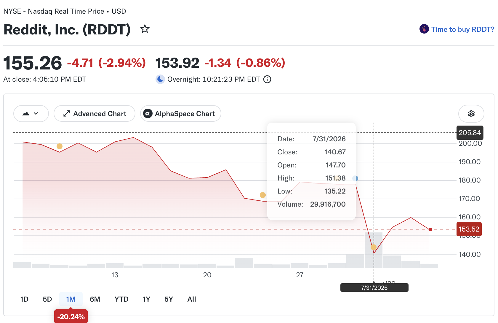
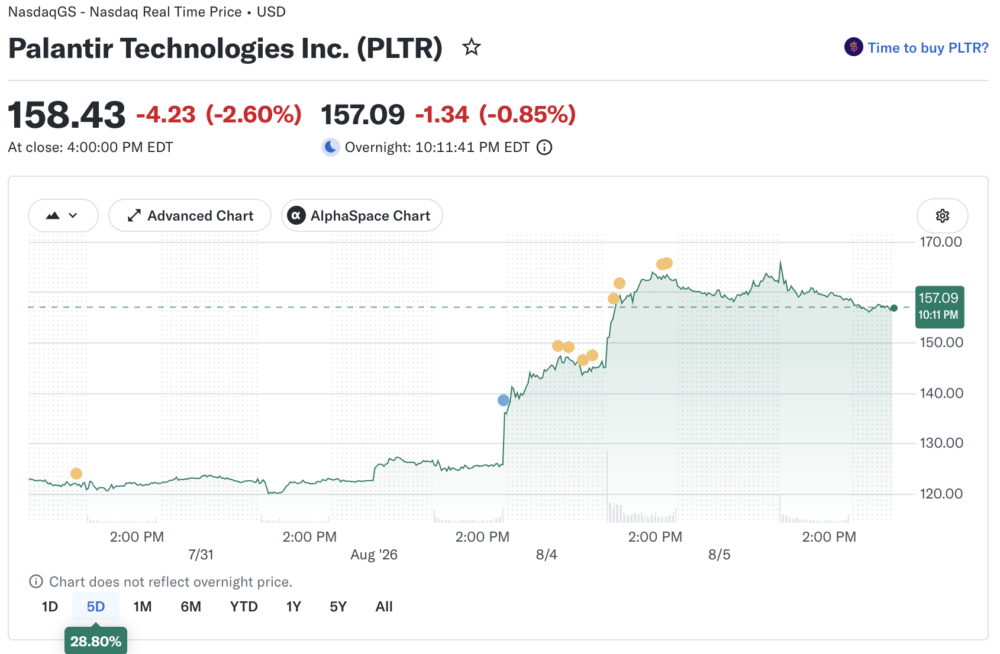

```
Come away, O human child!
To the waters and the wild
With a faery, hand in hand,
For the world's more full of weeping than you can understand.

-- W. B. Yeats, the stolen child, 1886
```

> Writing and reading about Fairies some may deem to be mark of a trifling turn of mind. On this subject ... dulce est desipere in loco. (It is sweet to be silly in places.) -- Thomas Keightley, the world guide to Gnomes, Fairies, Elves and other little people

> Some books are to be tasted, others to be swallowed, and some few to be chewed and digested; that is, some books are to be read only in parts; others to be read, but not curiously; and some few are to be read wholly, and with diligence and attention. -- Francis Bacon, The Essays

> **Have patience with everything that remains unsolved in your heart.** Try to love the questions themselves, like locked rooms and like books written in a foreign language. Do not now look for the answers. They cannot now be given to you because you could not live them. It is a question of experiencing everything. **At present you need to live the question.** Perhaps you will gradually, without even noticing it, find yourself experiencing the answer, some distant day. -- Rainer Maria Rilke, Letters to a Young Poet

>  Richard Feynman said: The first principle is that you must not fool yourself
and you are the easiest person to fool.

> Be the aim however high, Youth will find away ...

### Stefan Zweig

> Only the person who has experienced light and darkness, war and peace, rise and fall, only that person has truly experienced life. -- the world of yesterday

> “For I regard memory not as a phenomenon preserving one thing and losing another merely by chance, but as a power that deliberately places events in order or wisely omits them. Everything we forget about our own lives was really condemned to oblivion by an inner instinct long ago.” -- The World of Yesterday

> “Even from the abyss of horror in which we try to feel our way today, half-blind, our hearts distraught and shattered, I look up again and again to the ancient constellations that shone on my childhood, comforting myself with the inherited confidence that, some day, this relapse will appear only an interval in the eternal rhythm of progress onward and upward.” -- The World of Yesterday

> “We are happy when people/things conform and unhappy when they don't. People and events don't disappoint us, our models of reality do. It is my model of reality that determines my happiness or disappointments.” -- Chess Story

> For the first time in my life I began to realize that it is not evil and brutality, but nearly always weakness, that is to blame for the worst things that happen in this world.

> Freedom is not possible without authority - otherwise it would turn into chaos and authority is not possible without freedom - otherwise it would turn into tyranny.

### investing : how to gamble with stocks

* 20260731: Reddit downs a lot due to its earning on Thursday after hour. **buy this big drop in the early morning, since it's hard to know when it reaches the lowest, it has to be multiple buys. buy more lowers. so divide the budget at least by three** Then it rebounds a lot that Friday later and next two days for $157 and $162 in August.



* 20260804: Palantir reports its earning after hour. **buy before the market close. it's a bet that its result will be great. no one could know the future.**



* 20260805: SHOP reports its Q2 earning in the morning before hour, it reaches its high around US$159.5 and downs and ups to around US$145. It's about $124 yesterday. **It's up more than 20% but it does not last. anything could happen.**  


> **买 -- 顺应物极必反的逆向重仓**：事物向对立面转化、循环往复的运行规律。这要求投资者在美股遭遇悲观情绪笼罩、市场陷入惨烈熊市时，敢于逆着大众恐慌的潮流而动，果断加仓、甚至加上重仓。大自然与经济周期皆遵循盛极必衰、衰极必盛的法则。历史反复证明，并将继续证明，真正改变财富量级、赚到巨大财富的机遇，从来不是在牛市人声鼎沸的追涨中获得，而是**来自熊市深渊里冷静而坚决的逆势播种**。

> **等 -- 大道至简**：返璞归真的无为投资。市场本无序，绝大多数人试图通过复杂的工具和信息战胜市场，却往往适得其反。不试图去预测和选择进场时机，不触碰看跌或看涨期权这些充满投机与毁灭性的杠杆工具，不被纷繁复杂的K线图、财务报表所困扰，也彻底屏蔽来自财经媒体以及各类专家的噪音。**投资的至高境界是不动如山**，只买入代表美国国运和核心经济的宽基指数大盘，比如S&P500或全市场指数，**采取只买不卖、长期持有的策略。把复杂的操作归零，把时间当成最深厚的朋友**。

> **信 -- 好的股票一定会有好的回报，低买的股票一定会涨高**: the stock market is always cyclic, from undervalue to overvalue and reverse, from panic to greedy and back. in this way, a stock goes hot from cold and back again. any undervalued stock is a good stock. any undervalued stock of a good company is a great one. buy any good stock and wait. 

### John Crowley

> [Bowiesongs](https://bsky.app/profile/bowiesongs.bsky.social): "It was anyway all a long time ago; the world, we know now, is as it is and not different; if there was ever a time when there were passages, doors, the borders open and many crossing, that time is not now. The world is older than it was. Even the weather isn’t as we remember it clearly once being; never lately does there come a summer day such as we remember, never clouds as white as that, never grass as odorous or shade as deep and full of promise as we remember they can be, as once upon a time they were.”  from Little, Big.

> [John Crowley, "On Not Being Well Read" 2015, Harpers](https://harpers.org/archive/2015/03/on-not-being-well-read/): Knowing books, in that broad view, is like knowing people or social circles. Some people you are intimate with: you remember their pasts and know their private thoughts, you know the people they know; they form the texture of your life and your days. Other people stand farther off in time and space, but you feel you know them, even if superficially, and can ponder them usefully; they are your context. Others are still farther off. They are like those books you’ve only heard of but whose authors you know and can make reference to, nodding in recognition when others do.

> John Crowley: E. M. Forster writes in Aspects of the Novel that when his “brain decays entirely” he won’t bother any more with great literature; he’ll return to the “eternal summer” of a book he read and reread in boyhood, The Swiss Family Robinson. Not all books are classics. Not all books are even books.

This links to Francis Bacon on some books are to be tasted, others to be swallowed, and some few to be chewed and digested. That is, you read what you love to read and stop whenever you'd like.
 
### notes

* [Paul Heaton, 1962-, singer-songwriter, the Housemartins](https://en.wikipedia.org/wiki/Paul_Heaton)

> [Fish n chips supper](https://www.youtube.com/watch?v=jQcW5Di8IaE)

* [高善文,1971-2026,经济学家](https://zh.wikipedia.org/wiki/%E9%AB%98%E5%96%84%E6%96%87)

* [高善文：2025年可能是一个重要的转折点](http://hx.cnd.org/?p=261620)

> 我们以全部上市公司为基础（A股、港股，中概股），把这些公司分为三类，①支持类2500家，政府支持鼓励，支持经济转型引导方向；②限制类500家，政府试图加以规范管理和限制，行业自身也在走向衰落；③中性类2600家，商贸零售社会服务，和转型过程没有很紧密的联系，整体属于中性。上市公司营业收入占2024GDP总量50%以上，具有一定代表性。

> 2016年至今，中性类行业的营业收入/总市值占比总体稳定，2018-2020年之间，限制类行业占比明显收缩，支持类行业占比明显扩张，政府试图限制的行业在收缩，政府试图支持的行业在扩张，营业收入和总市值维度都是如此。2018年以来，支持类板块的股价上升，限制类板块的股价大幅下跌，二者之间的裂口是过去十几年没有看到的，这说明政府引导经济转型的努力在金融市场的定价反映出来。

> 我们通过观察中性行业的表现，去剥离转型和政策的影响。2017年以来，中性行业的营业收入大幅下滑，从这个指标来看，中性行业营业收入的下滑不是转型的影响，而是周期的力量；从雇佣员工数据来看也是如此。

> 疫情前：年轻人占比与消费不相关。疫情后：年轻人占比越高的省份消费越差。疫情前，消费和房价几乎不相关。疫情后，房价下跌严重的地区消费更差。

* 20260805: [Jeff Dean](https://en.wikipedia.org/wiki/Jeff_Dean), [Sanjay Ghemawat](https://en.wikipedia.org/wiki/Sanjay_Ghemawat), Oriol Vinyals and Quoc Le left Google to co-found a new company, Discovery Loop, to do scientific research based on AI.

* [FastLED](https://github.com/fastled/fastled)

* [picofx](https://github.com/pimoroni/picofx)

* [Grady Booch: three ages of software engineering](https://alexklos.ca/blog/how-do-we-stop-vibe-coding)

> The first, from the late 1940's to the 1970's, was the age of the algorithm. High-level languages and compilers abstracted away the machine.

> The second, from the 1970's to the 2000's, was the age of object-oriented abstraction.

> The third, starting around 2000, is the age of systems: libraries, platforms, and APIs abstracting away entire subsystems.

* [Y-Zipper 3D-printable](https://news.mit.edu/2026/three-sided-y-zipper-design-0504)

> Back in 1985, an electrical engineer at Polaroid named **Bill Freeman** had an idea for **a three-sided zipper**. 

> Freeman is now an MIT professor, and the researchers at MIT’s Computer Science and Artificial Intelligence Laboratory (CSAIL) finally did what his 1985 judges couldn’t: they took his concept seriously. The result is the Y-Zipper, a 3D-printed, three-sided fastener that can snap a floppy, flexible structure into a rigid, load-bearing beam with one smooth pull. 


* [清衣江: 微侃医林（185）临床思维（一）良医三大要素](http://hx.cnd.org/?p=244081)

> 良医三大要素: 医德，知识技术，临床思维的习惯和能力

> “如果他们盲目相信自己的眼睛，实际上他们就是盲目的。” Diagnosis: Interpreting the Shadows

> 教育的目的应该是教会我们如何思考，而不是教会我们思考什么；是提高我们的心智，使我们能独立思考，而不是把别人的想法塞进我们的记忆里。 -- 约翰·杜威 John Dewey (1859-1952)

> 尝试用一个病因解释所有异常、诊断要具体、化验图像检查不等于100% 确诊。

> book: How doctors think, by Jerome Groopman, M.D. 2008

> book: Every patient tells a story

* [清衣江：微侃医林（186）临床思维（二） 不确定性与量化可能性一一概率](http://hx.cnd.org/?p=244330)

> Medicine is a science of uncertainty and an art of probability （医学是不确定性的科学和可能性的艺术）。 -- William Osler

> 不确定性分两种：1) 认识的不确定性（**Epistemic**）: 病人实际情况、医学科学本身、诊断预测和治疗，太多信息我不知道，无法知道。自然界和人体太多秘密，科学知识本身也不知道。2) 随机性带来的不确定性 (**Stochastic**)。个体差异无法预测。统计、流行病学调查，可以发现一组人群，冠心病发病率多高，老年痴呆可能性多大。但是那个人群的具体每一个人，你无法知道他/她会不会患冠心病，会不会发生老年痴呆。福尔摩斯说过：一个人群，他可以预料。但是一个人，他无法预料。侦探和医生一样，总是和不确定性打交道。医生面临的是一个病人。而侦探面临的不仅是人，还有这个人所处的大环境。为什么有那么多不确定性？简单地说：因为人是地球上最高级的生物，**太多变量。这些变量，或者不知道，或者无法控制，因此无法确定。**

> 懂得不确定性，医生才不至于思维僵化；不至于先入为主，匆忙下结论；不至于死守既定方针，诊断治疗一成不变；不至于总是理所当然；不至于过分自信。虽然总是面临不确定性， 医生们不能以此作为偷懒的借口，而应该追求确定性，诊断、治疗、预后，同时对确定性的范围有一个现实的估计。

* [清衣江：微侃医林187 临床思维 三可能性比，四 循证医学与证据误区](http://hx.cnd.org/?p=244465)

> Sir Ronald Aylmer Fisher 1890 – 1962 

> 医学思维理论中， Possibility是若干可能发生的事件, 我们想要诊断或者排除的疾病 — 心肌梗塞、中风、肺炎等等。 Probability 是这些事件的概率。 Likelihood 是如果一个假设成立，得到有关证据的概率。例如一个病人发生了心肌梗塞，肌钙蛋白阳性的概率。Likelihood 像是敏感性（Sensitivity = 阳性结果人数/病人人数）。

> Likelihood ratio (LR) 比Likelihood 更重要。

> 阳性可比性比（Positive Likelihood ratio） [LR(+)] = 敏感性/(1-特异性) 或者说=真阳性率/假阳性率

> 阴性可比性比（Negative Likelihood ratio） [LR(-)] = 假阴性率/真阴性率 =（1-敏感性）/特异性

* [清衣江：微侃医林190 -- 九 我的临床思维](http://hx.cnd.org/?p=244992)

> book: The Science of the Art of Medicine 1st Edition, 2015, by J. E. Brush Jr MD

> book: Diagnosis: Interpreting the Shadows 1st Edition 2017.by Pat Croskerry, Karen Cosby, Mark L. Graber, Hardeep Singh 

* [Ricki Yasha Tarr @mastodon](https://beige.party/@RickiTarr)

> 20260806: Never forget that the stock market, the foundation of our modern economy, is just bros that tricked people into paying them to gamble.

> 20260806 @corbden@defcon.social: It's worse than gambling when said bros also have control over the magnet under the roulette wheel, and can use it to steal your money and put it in their pocket.

> 20260806 @eestileib@tech.lgbt: **The stock market looks like gambling, but it's actually fraud.**

> 20260806 @normjess@tech.lgbt: [Everybody Knows - Sigrid, youtube](https://www.youtube.com/watch?v=wfLOt5P6nSk)
  
* book: Useless Etymology, by Jess Zafarris

* book: If Only by [Vigdis Hjorth](https://en.wikipedia.org/wiki/Vigdis_Hjorth), tr Charlotte Barslund [Norwegian novelist](https://www.goodreads.com/author/show/736475.Vigdis_Hjorth)

* book: Troubled Waters by [Ichio Higuchi, 1872-1896](https://en.wikipedia.org/wiki/Ichiy%C5%8D_Higuchi), tr Bryan Karetnyk

* book: [Nao-Cola Yamazaki](https://en.wikipedia.org/wiki/Nao-Cola_Yamazaki), Don't Laugh at Other People's Sex Lives, tr Polly Barton 

* book: Misunderstanding in Moscow by Simone de Beauvoir, tr Terry Keefe and The Inseparables, tr Lauren Elkin

* book: Wild Swims by Dorthe Nors, tr Misha Hoekstra (Danish, born in 1970)

* book: Mothers and Truckers by Ivana Dobrakovová, tr Julia and Peter Sherwood (Slovak writer), [one youtube intro](https://www.youtube.com/watch?v=gkBBzRrqsDo)

* book: The Sacred Clan by Liang Hong, tr Esther Tyldesley (神圣家族, 梁鸿, 2015)

* 曹丕 燕歌行：（一韵到底，每句都押韵）

```
秋风萧瑟天气凉，草木摇落露为霜，群燕辞归鹄南翔。
念君客游思断肠，慊慊思归恋故乡，君何淹留寄他方？
贱妾茕茕守空房，忧来思君不敢忘，不觉泪下沾衣裳。
援琴鸣弦发清商，短歌微吟不能长。明月皎皎照我床，
星汉西流夜未央，牵牛织女遥相望，尔独何辜限河梁。
```

* 李渔 《笠翁对韵》举例。（既是韵书，又是词汇口诀，文史知识丰富多彩。押韵顺口）

```
江韵：
奇对偶，隻对双。大海对长江。金盘对玉盏，宝烛对银釭。
朱漆槛，碧纱窗。舞调对歌腔。兴汉推马武，谏夏著龙逄。
四收列国群王服，三筑高城众敌降。
跨凤登台，潇洒仙姬秦弄玉；斩蛇当道，英雄天子汉刘邦。
```

* [Iris Dement, 1961, singer and musician](https://en.wikipedia.org/wiki/Iris_DeMent)

> [Workin' on a world by Iris Dement, youtube](https://www.youtube.com/watch?v=VOS7OiLE11c)

```
I don't have all the answers
To the troubles of the day
But neither did all our ancestors
And they persevered anyway
When I see a little baby
Reaching out its arms to me
I remember why I'm workin' on a world
I may never see
```

> [In spite of ourselves, Iris Dement and John Prine, youtube](https://www.youtube.com/shorts/ZZp5jJPC3Vs)

* [iPhone models](https://support.apple.com/en-us/108044)

* [聂绀弩, 1903-1986](https://zh.wikipedia.org/zh-hans/%E8%81%82%E7%BB%80%E5%BC%A9)

> 聂绀弩，散宜生诗

> 龚定庵说得好：“诗与人为一，人外无诗，诗外无人”（《书汤海秋诗集后》）

> “五十便死谁高适，七十行吟亦及时。气质与诗竞粗犷，遭逢于我未离奇。老怀一刻如能遣，生面六经匪所思。我以我诗行我法，不为人弟不人师”（《答钟书》）

> 聂绀弩生前认为可相对谈诗的舒芜则评道：“聂诗乃是‘异端’的高峰”,“以杂文入诗，创造了杂文的诗，或诗体的杂文，开前人未有之境。”

> “一鞭在手矜天下，万众归心吻地皮”（《放牛》）

> “男儿脸刻黄金印，一笑心轻白虎堂”（《林冲题壁》）

> “天寒岁暮归何处，涌血成诗喷土墙”（《林冲题壁》）

> 题林冲题壁图寄巴人: 家有娇妻匹夫死，世无好友百身戕。男儿脸刻黄金印，一笑心轻白虎堂。高太尉头耿魂梦，酒葫芦颈系花枪。天寒岁暮归何处，涌血成诗喷土墙。

> “青眼高歌望吾子，红心大干管他妈”《钟三四清归》

> “文章信口雌黄易，思想锥心坦白难”（《挽雪峰》）

> “昔时朋友今时帝，你占朝廷我占山”。（《钓台》）

> 聂老赠胡风诗道：“世有奇诗须汝写，天将大任与人担”

* 舒芜

> 几度风，几度雨，披风戴雨且徐行；一卷书，一支笔，担书荷笔走人生

* [the secret garden, 1911 by Frances Hodgson Burnett](https://en.wikipedia.org/wiki/The_Secret_Garden)

* [Sarah Ellis, 1952-, writer and librarian](https://en.wikipedia.org/wiki/Sarah_Ellis_(author))

