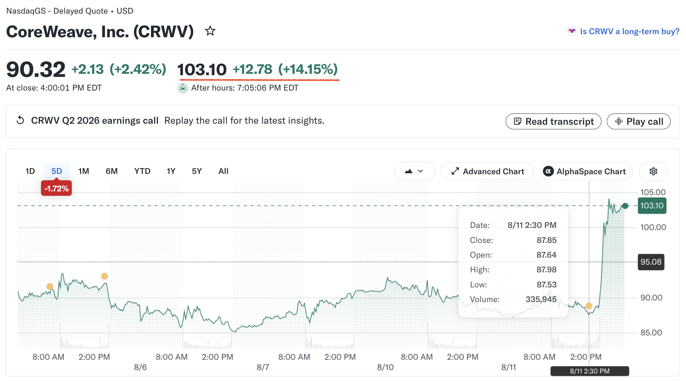

> “It is very nearly impossible to become an educated person in a country so distrustful of the independent mind.” -- James Baldwin

> “Religion is a culture of faith; science is a culture of doubt.” -- Richard P. Feynman, The Meaning of It All

> Don't just teach your children to read ... Teach them to question what they read. Teach them to question everything. -- George Carlin

> Nature composes some of her loveliest poems for the microscope and the telescope. -- [Theodore Roszak, 1933-2011](https://en.wikipedia.org/wiki/Theodore_Roszak_(scholar))

> He thought: there is not only more than one history of the world one for each of us who studies it; there is more than one for each of us, there are as many as we want or need, as many as our heads and wanting hearts can make. -- John Crowley

> "You try to preserve possibilities. You try to have a life that continues to open out, even though you know it doesn't" -- John Crowley

```
I needed nothing more; I was utterly sated.
My heart had become very small; 
it took very little to fill it.
I watched the rain falling in heavy sheets 
over the darkened city —

-- Louise Glück
```

Why is there not a single course to teach how to think like Math or Physics, if thinking critically is so important for education and life? I guess the issue is with thinking itself. As Kant was developing his philosophy, he realized that our mind is not a clean slate but with the faculty to generate patterns or ideas or concepts from sensory inputs for the mind to reason (or imagine something for the mind to entertain). Still why everyone could not think like Einstein? The reason is that our minds need some material to think with. To borrow one line from Confucius, "Learning without thought ends in a blur. Thought without learning will soon totter. 学而不思则罔，思而不学则殆。（论语）" Another translation could be "Learning without thinking is fruitless; thinking without learning is perplexing." That is, to think something has to go hands with to learn something specific to answer your curiosity and for you to question everything along the road.

life is desire and desire is life. it is a common problem for everyone that not all desire could be fulfilled. That causes frustration and sense of failure, and more desire to be desired. all religions have something to deal with desire as bit evil and bit enemy and bit friend. but to get rid of desire is not possible, so many ways to channel desire instead of blocking it are invented. faith for a better life, maybe. buddhism advocates less desire and so less pain. that is hard because everyone wants a full life and it is always full of desire. to channel it, there are work, rituals, institutions, art, code, law, and so on. everything is setup as barriers to desire like dams to river, good ways and legal ways after everything is codified if possible. like freedom, desire is there but not all of it is allowed.

### investing

* need to spend some time to make [the heatmap](https://finance.yahoo.com/markets/stocks/most-active/heatmap/) better. the hotness radar?

* 20260811 Tuesday: today both Super Micro Computer and CoreWeave are reporting their earnings after hour. Follow CoreWeave. Its price keeps falling this Monday and Tuesday. With indices of S&P500 (-0.32%), Dow30 (-0.34%) and Nasdaq (-0.6%) all down slightly, worried if its earning missed. The bet is hard and the result turns out great.



### [on politics and the art of acting by Arthur Miller, 2001](https://web.archive.org/web/20010907200127/http://www.neh.gov/whoweare/miller/lecture.html)

> The fact is that acting is inevitable as soon as we walk out our front doors into society.

> Aristotle thought man was by nature a social animal, and in fact we are ruled more by the arts of performance, by acting in other words, than anybody wants to think about for very long.

> In other periods, a person might confront the arts of performance once a year in a church ceremony or a rare appearance by a costumed prince or king and their ritualistic gestures; it would have seemed a very strange idea that ordinary folk would be so subjected every day to the persuasions of professionals whose studied technique, after all, is to **assume the character of someone who is not them**.

> **it gets harder and harder for a lot of people to locate reality anymore.** Admittedly, we live in an age of entertainment, but is it a good thing that our political life, for one, be so profoundly governed by the modes of theatre, from tragedy to vaudeville to farce? 

> Political leaders everywhere have come to understand that to govern they must learn how to act.

> I daresay that if he (Gore) seemed so awkward it was partly because the image was not really his, he had cast himself in a role that was wrong for him. 

> I was far more naive then, and so I still found it hard to believe that henceforth we were to be wooed and won by rouge, lipstick and powder rather than ideas and positions on public issues. It was almost as though he was getting ready to go on in the role of General Eisenhower instead of simply being him. In politics, of course, what you see is rarely what you get, but in fact Eisenhower was not a good actor, especially when he ad-libbed, disserving himself as a nearly comical bumbler with the English language when in fact he was actually a lot more literate and sophisticated than his fumbling public speaking style suggested. As his biographer, a Time editor named Hughes, once told me, Colonel Eisenhower was the author of all those smoothly liquid, rather Roman-style speeches that had made his boss, Douglas MacArthur, so famous. Then again, I wonder if Eisenhower's syntactical stumbling in public made him seem more convincingly sincere.

>> ad lib, adv. without previous preparation. I spoke ad lib. adj. spoken or performed without previous preparation. an ad-lib commentary. occuring, used or distributed as often as necessary or desired. the pigs are fed on an ad-lib basis.

> "My problem with this scene," Ben Ami explained, "was that I personally could never blow my brains out, I am just not suicidal, and I can't imagine ending my life. So I could never really know how that man was feeling and I could never play such a person authentically. For weeks I went around trying to think of some parallel in my own life that I could draw on. What situation could I be in where first of all I am standing up, I am alone, I am looking straight ahead, and something I feel I must do is making me absolutely terrified, and finally that whatever it is I can't do it?"

> "Yes," Lewis said, hungry for this great actor's cue to greatness. "And what is that?"

> "Well," Ben Ami said, "I finally realized that the one thing I hate worse than anything is washing in cold water. So what I'm really doing with that gun to my head is, I'm trying to get myself to step into an ice cold shower."

>> scion, descendant, child, esp. a descendant of a wealth aristocratic or influential family

> One remarkable thing did happen, though -- that single split second shot which revealed Gore shaking his head in helpless disbelief at some inanity Bush had spoken; significantly, this gesture earned him many bad press reviews for what was called his superior airs, his sneering disrespect -- **in short, he had stepped out of costume and revealed his reality.** This, in effect,was condemned as a failure of acting. The American press is made up of disguised theatre critics; substance counts for next to nothing compared to style and inventive characterization. For a millisecond Gore had been inept enough to have gotten real! And this clown wanted to be President yet! Not only is all the world a stage, but we have all but obliterated the fine line between the feigned and the real.

>> inanity, n. 1. the quality or state of being inane, such as a) vapid, pointless or fatuous character: shallowness. b) lack of substance: emptiness. 2. something that is inane. synonyms of inanity: insanity, idiocy, or absurdity

>> inept, adj. 1. generally incompetent: bungling. 2. lacking in fitness or apitude: unfit. 3. not suitable to the time, place or occasion. 4.lcking sense or reason: foolish

> Is it imaginable that any of our candidates could have such conviction, and more importantly such self-assured candor as to move him to pour out his heart this way? To be sure, Lincoln and Douglas, at least in the record of their remarks, were civil to one another, but the attack on each other's ideas was sharp and thorough, revealing of their actual approaches to the nation's problems. As for their styles, they had to have been very different than the current laid-back cool before the lense. 

> Given the camera's tendency to exaggerate any movement, it may in itself have a dampening effect on spontaneity and conflict.

> No differently than with actors, the single most important characteristic a politician needs to display is relaxed sincerity. Ronald Reagan disarmed his opponents by never showing the slightest sign of inner conflict about the truth of what he was saying. Simple-minded though his critics found his ideas and remarks, cynical and manipulative as he may have been in actuality, he seemed to believe every word he said; he could tell you that atmospheric pollution came from trees or that ketchup was a vegetable in school lunches, or leave the implication that he had seen action in World War II rather than in a movie he had made or perhaps only seen, and if you didn't believe these things you were still kind of amused by how sincerely he said them. Sincerity implies honesty, an absence of moral conflict in the mind of its possessor. Of course this can also indicate insensitivity or even stupidity. It is hard, for example, to think of another American official whose reputation would not have been stained by saluting a cemetery of Nazi dead with heartfelt solemnity while failing to mention the tens of millions of victims of their vile regime, including Americans. But Reagan was not only an actor, he loved acting and it can be said that at least in public he not only acted all the time but did so sincerely. 

> The second best actor is Clinton, who does occasionally seem to blush, but then again he was caught in an illicit sexual act which is far more important than illegally shipping restricted weapons to foreign countries. Reagan's tendency to confuse events in films with things that really happened is often seen as intellectual weakness but in reality it was -- unknowingly of course -- a Stanislavskian triumph, the very consummation of the actor's ability to incorporate reality into the fantasy of his role; in Reagan the dividing line between acting and actuality was simply melted, gone. Human beings, as the poet said, cannot bear very much reality, and the art of politics is our best proof. The trouble is that a leader somehow comes to symbolize his country, and so the nagging question is whether, when real trouble comes, we can act ourselves out of it.

> The parallels between acting and politics are really innumerable and, depending on your point of view, as discouraging as they are inevitable. The first obligation of the actor, for example, just as with a politician, is to get himself known. 

> The reporter asked if this ploy wouldn't anger people and ruin his reputation. Barnum gave his historic reply, "I don't care what they say about me as long as they mention my name." If there is a single rubric to express the most basic requirement for political or theatrical success, this is it. (in politics infamous equals famous.)

> Whether admitting or not, the actor wants to be not only believed and admired but loved.

> It occurs to me at this point that I ought to confess that I have known only one president who I feel confident about calling The President of the United States, and that was Franklin Roosevelt. My impulse is to say that he alone was not an actor, but I probably think that because he was such a good one.

> The mystery of the star performer can only leave the inquiring mind confused, resentful, or blank, something that of course has the greatest political importance. Many Republicans have blamed the press for the attention Bill Clinton continued to get even out of office. 

> Obviously, this is not very encouraging news for rational people trying to uplift society by reasoned argument. But then not many of us rational folk are immune to the star's power to rule.

> What Brando had done was not ask the audience to merely love him, that is only charm; he had made them wish that he would deign to love them. That is a star. On stage or off, that is power, not different in its essence than the power that can lead nations.

>> deign, v. to condescend reluctantly and with a strong sense of the affront to one's superiority that is involved : stoop. to condescend to give or offer.

>> stoop, v. 1. a) to descend from a superior rank, dignity or status. b) to lower oneself morally. 2. a) to bend the body or a part of the body forward and downward sometimes simultaneously bending the knees. b) to stand or walk with a forward inclination of the head, body or shoulders. 3. yield, submit.

> And of course on stage or in the White House, power changes everything, even including how the aspirant looks after he wins. 

> And once having ascended to power, so to speak, it became hard even for me to remember him when he was real. Not that he wasn't real, just that he was real plus. And the plus is the mystery of the patina, the glow that power paints on the human being.

>> patina, n. 1a. a usually green film formed naturally on copper and bronze by long exposure or artificially (as by acids) and often valued aesthetically for its color. 1b: a surface appearance of something grown beautiful especially with age or use. 2: an appearance or aura that is derived from association, habit, or established character. 3: a superficial covering or exterior.

> An election, not unlike a classic play, has a certain strict form which requires that it pass through certain ordained steps to a logical conclusion. When, instead, the form dissolves and chaos reigns, what is left behind -- no differently than in the theatre -- is a sense in the audience of having been cheated and even mocked. After [this last, most hallucinatory of our elections](https://en.wikipedia.org/wiki/2000_United_States_presidential_election), it was said that in the end the system worked when clearly it hadn't at all. And one of the signs that it had collapsed popped up even before the decision was finally made in Bush's favor; it was when a Republican leader, one Dick Armey, declared that if Gore were elected he would simply not attend his inauguration despite immemorial custom and his obligation to do so as one of the leaders of the Congress. In short, Mr. Armey had reached the limits of his actor's imagination and could only collapse into playing himself. But in the middle of a play you can't have a major performer deciding to leave the scene without utterly destroying the whole illusion. For the system to be said to have worked, no one is allowed to stop acting.

> The absence of any great affection or love for the candidates also suggests some distinct correlations in the theatre. The play without a character we can really root for is in trouble. Shakespeare's "Coriolanus" is an example. It is not often produced, powerful though it is as playwriting and poetry, no doubt because, as a totally honest picture of power hunger in a frightening human being, the closest he ever gets to love is his subservience to his mother. In short, it is a truthful play without sentimentality, and: truthfulness, I'm afraid, doesn't sell a whole lot of tickets or draw votes.

> Which inevitably brings me to Clinton. Until the revulsion brought on by the pardon scandal, he was leaving office with the highest rating for his performance and the lowest for his personal character. Translated -- people had prospered under his leadership, and with whatever reluctance they still connected with his humanity as they glimpsed it, ironically enough, through his sins. We are back, I think, with the mystery of the star. Clinton, except for those few minutes when lying about Lewinsky, was relaxed on camera in a way any actor would envy. And relaxation is the soul of the art, for one thing because it arouses receptivity rather than defensiveness in an audience.

> That receptivity brings to mind a friend of mine who many years ago won the prize for selling more Electrolux vacuum cleaners in the Bronx than any other door-to-door salesman. He explained once how he did it. "You want them to start saying 'yes.' So you ask questions that they can't say no to. 'Is this 1350 Jerome Avenue? Yes. Is your name Smith? Yes. Do you have carpets? Yes. A vacuum cleaner? Yes." Once you've got them on a 'yes' roll a kind of psychological fusion takes place, you're both on the same side, its almost like some kind of love and they feel it's impolite for them to say no, and in no time you're in the house unpacking the machine. 

> What Clinton projects is his personal interest in the customer, which comes across as a sort of love. There can be no doubt that like all great performers he loves to act, he is most alive when he's on; his love of acting may be his most authentic emotion, the realest thing about him, and as with Reagan there is no dividing line between his performance and himself -- he is his performance. There is no greater contrast than with Gore or Bush, both of whom projected a kind of embarrassment at having to perform, an underlying tension between themselves and the role, and tension, needless to say, shuts down love on the platform no less than it does in bed.

> [Eulenspiegel](https://en.wikipedia.org/wiki/Till_Eulenspiegel):  the mythical arch prankster of 13th Century Germany, who was a sort of mischievous and loveable folk spirit, half child- half man. Eulenspiegel challenged society with his enviable guile and a charm so irresistible that he could blurt out embarrassing truths about the powerful now and then, earning the gratitude of the ordinary man.

> [Brer Rabbit](https://en.wikipedia.org/wiki/Br%27er_Rabbit): 

> The ultimate foundation of political power, of course, has never changed and it is the leader's willingness to resort to violence should the need arise.

> Then, I'm afraid, we can only turn to the release of art, to the other theatre, the theatre-theatre where you can tell the truth without killing anybody, and may even illuminate the awesomely durable dilemma of how to lead without lying too much. The release of art will not forge a cannon or pave a street but it may remind us again and again of the corruptive essence of power, its immemorial tendency to enhance itself at the expense of humanity. 

### [wiki: Va, pensiero by Verdi, or Chorus of the Hebrew Slaves](https://en.wikipedia.org/wiki/Va,_pensiero)

> [Va, pensiero from Verdi's opera Nabucco, act III](https://www.youtube.com/shorts/jNGsyxyV3rY)

> [Va, pensiero by Chicago Symphony](https://youtu.be/MBYmhYxEvUM?si=OXov7yUIBWRoI1UV)

> [秦见来：《飞吧，思想》何以成为最动人的合唱](http://hx.cnd.org/?p=261477)

> 此曲底蕴，首先藏在旋律之中。世有写歌者，辄谓”好听”之旋律，必大跳、必炫技、必出人意表。而威尔第则不然，其谓真正动人者，惟在肖似人言。意大利歌剧之传统，有至理名言：歌唱即放大的说话。《Va, pensiero》的主旋律，几乎全由音阶级进而成，即相邻之音一一拾级而上或下。试轻哼其起句，仿佛一人轻喟，似自语，似低诉。级进既多，听者自然会产生‘诉说之感’——仿佛不是伶人在台上唱，而是一个有血有肉的人，凑在耳边倾诉乡愁。然通篇级进，亦失之平淡。威尔第之高妙，正在于将”跳跃”如刀刃般安放，惟于情绪亟待喷薄之一瞬，方舍得一用。故副歌听一遍即能随声而和，非因其”简”，乃因其顺应人声之自然——天生为人之喉而作，非为谱上符号而也。

> 复论”停顿”。世有歌自首至尾奔腾不息者，闻之令人倦怠，为何？人须呼吸，音乐亦然；人心亦须有片刻余裕，使耳之所闻，渐化为心之所感，才能将声响沉淀为情感，将情感酝酿为共鸣。威尔第于《Va, pensiero》中，每于小乐句之末，辄留些许余白，若人言之换气，如诗句之逗顿。德彪西尝言：“音符之间的空白才是音乐的真谛。”空白非沉默，乃情感发酵时刻。当一句思念入耳，继以一瞬停顿，此思念非但不散，反在听者心中缓缓沉潜，渐次化开。更妙者，威尔第多用问答式乐句：前句若问，后句若答。有问而无答，则心悬而未释；有答而无问，则意平而少波。一问一答，一呼一吸，恰合人类言语往复的天然节律。

> 再谈重复。此曲主题旋律，反复再三。按理重复既多，易生倦意。然此曲愈听愈动人。其故安在？威尔第于每次重复，暗换其背景：初起弦乐轻托，再奏木管悄入，三度四部齐开，终章铜管全奏。旋律未变，变者，光之角度、空间之阔狭、颜色之深浅。人短时记忆极狭，威尔第未尝挑战记忆之限，反顺而为之，一遍遍加深其痕。故初听立其印象，再听随声而和，三听则镌刻于心。

> 观其和声。取谱细览，或惊讶其简：全由主和弦、下属和弦、属和弦构成。威尔第非不能为繁，乃其和声哲学在“减法”。旋律既已有力，和声愈繁，则愈成干扰。更进一层，威尔第将和声之回家机制，与歌词之回乡主题相绾合。主和弦予人以安，属和弦造其悬念，终归主和弦——和声解决与情感归宿，若合符节。末音落定，胸中油然踏实之感，即”回家”之听觉映射。

> 配器方面更见功力。粗心者写此旋律，必管弦尽数堆叠；威尔第不然。弦乐但作”空气”，若一层暖色包裹人声；木管中，长笛如远天之空；双簧管专司触碰乡愁那根神经；铜管前中期几不出声，待末段高潮方轰然响起，此非音量变大，乃”压抑之久，终于决口”。最妙者，全曲少有诸器齐鸣之时，盖知：沉默本身就是一种声音。

> 论及高潮。新手写歌，以为高潮即”加大音量、飙升高音”；《Va, pensiero》之高潮，则以漫长”低气压”熬成。开篇极弱，中段徐徐升温，声部层层叠加，待铜管于末章加入，所闻非“轰然一声”，乃“忍泪之久，终于憋不住”耳。

> 合唱之妙，亦极讲究。独唱者，一人之心事；合唱者，一族之共鸣。威尔第于《Va, pensiero》中广用同音齐唱——数十百人同律同音同唱一句时，非复独立之众声，乃一庞大生命体之共搏。不仅如此，《Va, pensiero》原作采用升F大调，旋律线主要分布于中音区，四个声部各自在其最适音域内歌唱，呼吸同频，起落如一，遂得高度统一、温暖而富有包容感的合唱音响。四声各司其职，如一人般呼吸，同起同落。

> 全曲结尾尤耐寻味。多数歌剧合唱喜以强音收束，而《Va, pensiero》偏偏择极弱而终，声渐轻，若远行之队徐徐没于地平，在心理上造出距离与延展。文辞虽止，画面未停；歌声虽逝，思念反因”不可闻”而愈发明晰。

> 《Va, pensiero》之伟大，不在其繁，而在其以最简之法，触人情最深之处。世人常观此曲结构至简、和声至朴，倘易一庸手写之，极易沦为平淡无奇；然出自威尔第之手，首演即惊动天下，传唱为时代强音。盖庸手之“简”，乃技穷而致苍白；大师之“简”，乃洗尽铅华后之至纯，是深谙人声生理、听觉心理与情感爆破点后之极致收敛。同等作品，出自不同人之手，效果天差地别，古今皆然，此属于社会心理与传播学研究范畴，笔者无意深谈。

### notes

* [an apology from a Japanese volleyball player](https://bsky.app/profile/yourdigitalbrain.bsky.social/post/3mt76rka2ba27)

> There is something very special about the respect for others in Japan

* book: the nerd reich: silicon valley fascism and the war on democracy, by Gil Duran

* book: The Heart Of Rock & Soul, by [Dave Marsh, 1950-2026, American music critic](https://en.wikipedia.org/wiki/Dave_Marsh)

> Rock & Soul is essential still: a defense of & a love letter to pop music.

* book: the myth of the negro past, by Melville Herskovits

> founded the first African Studies program in the country at Northwestern and its largest library. now Northwestern University is reportedly shuttering its 80-year-old Program of African Studies, laying off staff and keeping students in the dark.

* [Ralph Marston, 1907-1967, American football player](https://en.wikipedia.org/wiki/Ralph_Marston)

> The keys to patience are acceptance and faith. Accept things as they are, and look realistically at the world around you. Have faith in yourself and in the direction you have chosen. -- Ralph Martson

> Happiness is a choice, not a result. Nothing will make you happy until you choose to be happy. No person will make you happy unless you decide to be happy. Your happiness will not come to you. It can only come from you.

> Just because the road ahead is long, is no reason to slow down. Just because there is much work to be done, is no reason to get discouraged. It is a reason to get started, to grow, to find new ways, to reach within yourself and discover strength, commitment, and determination. The road ahead is long and difficult, but it’s filled with opportunity. Start what needs starting. Finish what needs finishing. Get on the road. Stay on the road. Don’t give up.

> What you hold in your heart, you will see in your world.

> Life does not owe you anything, because life  has already given you everything.

* Faith is taking the first step even when you don't see the whole staircase. -- Martin Luther King, Jr.

* [Symphony No. 8 (Dvořák)](https://en.wikipedia.org/wiki/Symphony_No._8_(Dvo%C5%99%C3%A1k))

> [youtube](https://www.youtube.com/watch?v=8KsXPq3nedY&list=RD8KsXPq3nedY&start_radio=1)

* 瑞士大雪山

> 瑞士有一多半国土在阿尔卑斯山脉上。此山脉的最高峰勃朗峰（海拔4810米）却在瑞士之外的法国意大利边境上。面前的少女峰（海拔4158米）、僧侣峰（海拔4107米），还有另几座高峰，都白雪皑皑，景色非凡。

> 山太高会导致壮观有余而美丽不足。四千米以上就没树了，甚至草都不多，除了白色山峰就是裸露的岩石，满是荒漠景观。阿尔卑斯山的雪峰之下紧接绿色的草甸和苍翠的森林。高山牧场上牛羊的铃铛声，还有山间的湖泊映照着雪峰，湖光山色，美不胜收。

* 李欧梵: 《我的二十世纪：李欧梵回忆录》 

> 多莱热尔: 没有好的作家和作品，不可能产生好的文学理论！

* idea: a device to capture MAC address of all wireless devices around you such as WiFi, Bluetooth, RFID and so on. why? know people around you.

* [how to whistle](https://howtowhistle.org)

> use whistle to create a song score?

* grep command

```
grep -rni "text string" /path/to/directory

-r performs a recursive search within subdirectories.
-n displays the line number containing the pattern.
-i ignores the case of the text string.
```

* 王彬彬：《并未远去的背影》

> 盛岳（盛忠亮）晚年在美国所写的《莫斯科中山大学和中国革命》一书中说得好：”不成问题，所谓的二十八个布尔什维克是俄国人精心培养的。俄国人这样做的惟一目的，是为了控制中共，把它改造成一个无限忠于苏俄和共产国际的政党。”

> 李竹声于1934年6月被捕叛变，加入”中统”。接替李竹声的，是《莫斯科中山大学和中国革命》一书的作者盛岳。盛岳于1934年10月被捕，也立即叛变，加人”中统”。

> 以瞿秋白的革命资历和曾经的政治地位，以瞿秋白在文学艺术上的修养造诣，很快便成为”左联”的精神领袖和实际上的领导人之一。瞿秋白则更是在文艺理论问题上笔耕不缀。这一点已足以令王明团伙嫉恨了。更糟糕的是，在实际的政治问题和理论性的政治问题上，瞿秋白仍然坚持发言。

* Rachmaninoff 拉赫玛尼诺夫 

> [帕格尼尼主题狂想曲 Rhapsody on a Theme of Paganini](https://en.wikipedia.org/wiki/Rhapsody_on_a_Theme_of_Paganini) [youtube: Rachmaninoff variation 18 on Themes of Paganini Valentina Lisitsa](https://www.youtube.com/watch?v=yTyiwtfpO8s)

> [wiki: 交响舞曲 Symphonic Dances, 1940](https://en.wikipedia.org/wiki/Symphonic_Dances_(Rachmaninoff)) [youtube](https://www.youtube.com/watch?v=paKhgI9JoTQ)

> 流亡中的拉赫玛尼诺夫骨子里依然是个俄罗斯人。他说俄语，吃俄餐，家里更布置成俄罗斯风格。在他仅有的几部流亡国外后写成的作品中，总是忽隐忽现着俄罗斯山川原野的广袤辽远和传统艺术的多彩细腻，教堂的钟声此起彼伏。他难忘故国，撇不下自己长于其中的土地，解不开深入骨髓的俄罗斯情怀。这浪漫中的悲凉与忧伤，成为他的后期作品的底韵。

> movie: [Somewhere in Time, 1980, 時光倒流七十年,似曾相识](https://en.wikipedia.org/wiki/Somewhere_in_Time_(film))

* [confucius quotes and translation in English](https://wist.info/author/confucius/)

> Choose a job you love, and you will never have to work a day in your life. -- Confucius

* [dungeonlust: fantasy art on bsky.app](https://bsky.app/profile/dungeonlust.com)

* [Larry Elmore, fantasy artist](https://bsky.app/profile/did:plc:fpdxp3dcu2k35kyuukr4wgzm)

* [Ralston Creek, Colorado](https://en.wikipedia.org/wiki/Ralston_Creek_(Colorado))

* [barcode-maker - code128](https://barcode-maker.com/Code128)

* [Believer.net: an interview with John Crowley](https://www.thebeliever.net/an-interview-with-john-crowley/)

> “It’s probably central to the nature of fiction altogether, to try to enter into lost worlds or enter into ‘the lost’ in some way.” -- John Crowley

> Ed Halter: Your novels exist somewhere between fantasy and science fiction and naturalistic fiction. Do you have any interest in the way the term slipstream has been circulating in the last few years to describe this kind of moving among genres?

> john crowley: certainly the kind of fiction that always interested me is stuff that somehow manages to be convincingly actual -- in the sense that you believe that truths are being told about the world you live in -- and are also somehow connected to the imaginary in some way.

> john crowley: There’s a moment in the last volume of Ægypt in which a little girl is singing the wedding. The text says, “In her singing and our listening was completed the renovation and atonement we all needed, whether or not we knew we had longed for it and sought for it, or would ever recognize we had it. It was the Great Instauration of everything that had all along been the case.” **I wanted to restore the world to what it had been, to this world we know, not make a new one.**

> blog: http://crowleycrow.livejournal.com/

* [zeno, old photos](http://www.zeno.org/Fotografien)

* [noah kalina, photos archive](https://archive.noahkalina.com)

* [Asian historical architecture](https://www.orientalarchitecture.com/cid/11/china/beijing)

* 鲁迅：“此别成终古，从兹绝绪言。故人云散尽，我亦等轻尘。”

* book: 托克维尔的《旧制度与大革命》: 不惜一切代价发财致富的欲望、对商业的嗜好、对物质利益和享受的追求，便成为最普遍的感情。这种感情轻而易举地散布在所有阶级之中，甚至深入到一向与此无缘的阶级中，如果不加以阻止，它很快便会使整个民族萎靡堕落。(利欲熏心) L'Ancien Régime et la Révolution (1856) is a work by the French historian Alexis de Tocqueville translated in English as either The Old Regime and the Revolution or The Old Regime and the French Revolution.

* Tom Disch: Misremembering John Crowley

> Readercon #3 Programme Book, 1990: Many very good writers seem not to have been very nice people. Some, like Frost or Hemingway or Mencken, end up losing a large part of their posthumous cachet as their friends and biographers and even their own diaries make it clear that there was a Jekyll-and-Hyde-wide chasm between the man and the mask. As far as I can tell John Crowley is actually as nice as the people he writes about in Engine Summer and Little, Big and AEgypt, books that inspire readers to a special kind of readerly love precisely because their protagonists have a quality of ideal human sociability that is huggable without being sappy, charming without being coy, kind-hearted without being thick-headed. Perhaps there is another crueller, growly Crowley whom I’ve never met, but if
so, he is an extremely adept and secretive fellow who’s been able to fool not only me but all John’s other friends of both sexes, since the only thing I’ve ever known any of them to say about John behind his back is how preternaturally nice he is. A good many people (writers) envy him, and in extreme cases may profess to dislike his work, but only in the way that Scrooge dislikes Christmas, out of misanthropy, or the way Salieri is said to have disliked Mozart. For Crowley’s work is at that level of greatness that sets the parameters by which other work must be measured. It is absolutely good

> I understand that the traditional form of these convention-booklet appreciations is to reveal choice intimate details about the appreciated author’s private life. It is not a tradition I can easily observe, for though I have no compunction about gossiping, I don’t remember the details of my life (or my friends’ lives) only the generalities. I have been chez Crowley on a few occasions, most memorably a book party for Little, Big at John’s then home in the Berkshires, a party that had some of the flavor of the big riverside do in AEgypt. I can tell you that John’s manner of home decoration was rather spare than cluttered, with a Japanese (or Shaker or French provincial) knack for making seemingly humble objects yield their numinous potential, a knack one 

* [Tom Disch, 1940 - 2008, American science fiction writer and poet](https://en.wikipedia.org/wiki/Thomas_M._Disch)


