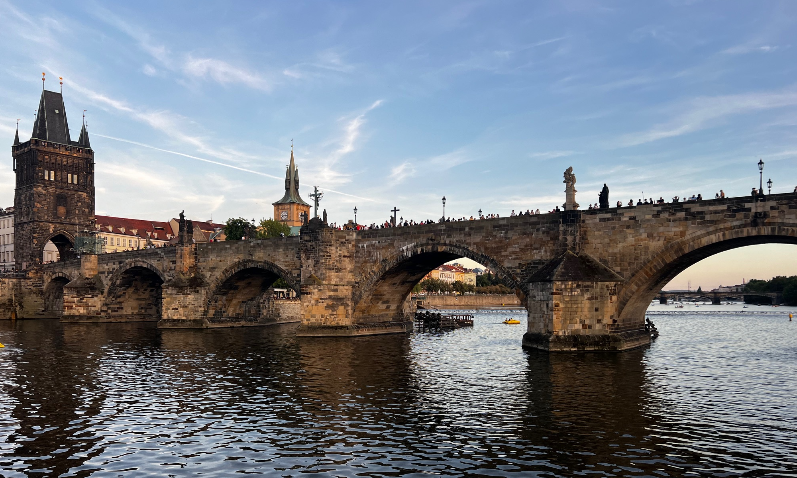

[查理大桥](https://en.wikipedia.org/wiki/Charles_Bridge)始建于1357年，是一座哥特建筑和巴洛克雕像的华美融合。它横跨伏尔塔瓦河，有六座拱门桥墩和三座塔楼。查理大桥连接了布拉格城堡与老城，布拉格连接了东欧与西欧。

人上有人人压人，山外有山山连山。为什么生活中总有一种挣扎的感觉？欲求太多而时间和精力有限。

### investing

* 20261001: The 10-year Treasury yield, used as a benchmark for mortgages and other loans, rose to 5.33%, its highest level since 2002. Brent oil futures for November delivery reed relatively unchanged near $103 a barrel.

### notes

* [蒙克：北越上校回忆越战、解放军和美国战俘]()

> book: 裴信（Bùi Tín）Bui Tin, Following Hi Chi Minh: memoirs of a north vietnamese colonel

> 裴信后来担任过越共党报《人民日报》的副总编。他在80年代中期开始对越南战后的腐败和在国际上的孤立感到失望。1990年裴信离开越南开始了在巴黎的流亡生涯。他一直公开表达对越共领导层和越南政治制度不满。

> [越军前高官眼中的解放军，越战和中越冲突 BBC 2013/10/10](https://www.bbc.com/zhongwen/simp/china/2013/10/131010_bui_tin_china_vietnam_maccan)
 
* [马四维：意义、幸福源于抉择与行动](http://hx.cnd.org/?p=252181)

> 《维特根斯坦传：天才之为责任》这本传记展示的，是一个把“说清楚”与“活认真”当作同一件事的人：在界限前保持诚实，在实践中寻找明白。这本书对今天人的价值，在于把几个简单而坚硬的命题重新推到面前：幸福从何而来？意义如何安放？当生命遭遇不可承受之痛，是否可以把“理性”化为终局的决定？

> book: Ludwig Wittgenstein: The Duty of Genius, by Ray Monk, 1990

> book: Ludwig Wittgenstein by [Edward Kanterian](https://www.kent.ac.uk/philosophy/people/1685), 2007

> book: Time of the Magicians: Wittgenstein, Benjamin, Cassirer, Heidegger, and the Decade That Reinvented Philosophy by Wolfram Eilenberger (Author), Shaun Whiteside (Translator) 

> 《逻辑哲学论》主张：语言的边界，塑造着人所能把握的世界。“我的语言的界限意味着我的世界的界限”(Wittgenstein, Tractatus 5.6)。这不是语言学句法，而是存在的提醒：许多关于价值、意义、上帝与人生的重大问题，并非“可说的事实问题”，而是“不可说而唯可显现”的域。他在书末宣示：“凡不可说者，必须保持沉默”(Wittgenstein, Tractatus 7)。这条线，把科学讨论与人生难题分际标出：科学能解释事实，却触不到“价值为何为价值”。

> 《哲学研究》把目光从逻辑形式移向“我们说话—行动的方式”。他指出：“一个词的意义，就是它在语言中的用法”(Wittgenstein, Philosophical Investigations §43)；哲学的任务，是“与语言对理智的蛊惑作战”(Wittgenstein, Philosophical Investigations §109)。这条线，把抽象理论转回共同体的实践：意义不是在头脑里，而是在公共活动中；伦理不是一句口号，而是被看见的生活样式。

> 其一：为语言祛魅。许多焦虑来自概念的混乱。先把“能说清”的与“不可说”的分开。能说清的，就用朴素语言把事实摆出来；不可说的，就用行动去承担，用沉默给出边界。少一些“宏大词”，多一些“准确词”。这会减少误解，也会降低人与人之间的摩擦。

> 其二：把价值落在手上。幸福离不开“做”。不论是教书、写作、护理，还是手工，一项认真做好的工作，会带来稳定而内在的满足。维特根斯坦对“细节”的近乎苛求，是提醒：审美与伦理相通；把一件事情做漂亮，就是把自己摆到一个更有秩序的位置。

> 其三：简化欲望，降低虚荣的占比。他把遗产让出，把生活压到简单的尺度。这不是鼓励贫穷，而是反对被占有物反过来占有。幸福感很大一部分来自“减少无谓比较”，把注意力从“别人怎样看”转回“自己怎样做”。

> 其四：对痛苦保持正视，但不夸饰。他不否认痛苦，也不拿痛苦当旗帜。承认它，描述它，给它留位置；同时用工作与关怀把自己从痛苦里提出一点。幸福不是消灭痛苦，而是把痛苦安置在更大的秩序里。

> 其五：给孤独正名。他多次隐居写作、断开社交。孤独不是反社会，而是“与自己对齐”的必要工序。适量的独处，使人能看见内心的真实需求，防止在嘈杂中迷失。

> 其六：对真诚保持敬畏。他把“说谎”当作对自我的破坏。真诚处理错误，勇于道歉，比辩解更能减少长期的损耗。关系中的信任，来自这种不耍滑、不装饰的态度。

> 幸福不是一次性的顿悟，而是许多小决定的累加。维特根斯坦的一生并不“顺遂”，他常被焦虑追逐，也常对自己失望；但他从未放弃对诚实与清澈的追求。

* [翦一休：摩尔和维特根斯坦，及其捍卫常识的接力](http://jianyixiu.hxwk.org/2023/09/19/%E6%91%A9%E5%B0%94%E5%92%8C%E7%BB%B4%E7%89%B9%E6%A0%B9%E6%96%AF%E5%9D%A6%EF%BC%8C%E5%8F%8A%E5%85%B6%E6%8D%8D%E5%8D%AB%E5%B8%B8%E8%AF%86%E7%9A%84%E6%8E%A5%E5%8A%9B/)

> G.E.Moore(G. E. 摩尔)1893年进入剑桥大学。在此后的30年中，与罗素和维特根斯坦一道，推动了哲学研究从心灵分析到语言分析的转向，一手开创了作为英美哲学主流的分析哲学。

> 分析哲学，即使是作为一种哲学研究的风格和品味而非一种学派，其实也分为两支：主流是从罗素那里得来的逻辑主义，以逻辑实证主义为代表；支流则是从摩尔这里继承的日常语言的概念分析，后来为日常语言学派发扬。维特根斯坦的地位比较复杂 ，他可以说在早期和晚期分别对两派都有影响。剑桥大学从新黑格尔主义的桥头堡到分析哲学大本营的历史性转变

* [Robert Palmer, Addicted to love](https://www.youtube.com/watch?v=XcATvu5f9vE)

> [Shania Twain, Man! I feel like a woman](https://www.youtube.com/watch?v=ZJL4UGSbeFg&list=RDZJL4UGSbeFg&start_radio=1)

* [100 books' quotes](https://quotewise.io/c/quotewiser/100-books-every-educated-adult-should-know/)

> what doesn't kill you makes you stronger? No.

> Erich Maria Remarque: This book is to be neither an accusation nor a confession, and least of all an adventure, for death is not an adventure to those who stand face to face with it. It will try simply to tell of a generation of men who, even though they may have escaped shells, were destroyed by the war. 

* book: Why It’s Better To Be Struggling Half-way Up A High Hill On Your Own: A Poetry Collection by Aidan Parr

* [kagi, a better way to use the web](https://kagi.com)

* book: Strange Justice: The Selling of Clarence Thomas, by Jane Mayer, Jill Abramson, 1994

* [Daring Fireball](https://daringfireball.net)

> 20260930: **Anthropic** is making a massive bet that AI will transform the global economy more profoundly than industrialization, electricity and the internet, according to its IPO prospectus seen by Reuters.

> This is not an IPO that makes sense if you consider Anthropic one among peers, even a short list placing them alongside just (say) OpenAI, Google, and Meta. It only makes sense if you believe Anthropic is on the cusp of winning a race to create a godlike super intelligence, and that first godlike super intelligence will take over the world.

> But the cost to get there will be staggering. Anthropic reported a net loss of $42 billion in 2025, and plans to spend $518 billion on cloud, computing and infrastructure obligations in coming years, according to the prospectus.

> Their revenue is accelerating rapidly because they’re selling compute at a loss. **They spent $13 billion to make $5 billion last year. Their revenue is growing rapidly, yes, but their costs are growing even faster.**

> Gary Marcus: Anthropic’s proposed valuation is easily calculated, as about 50 times 2025 losses. **The more they lose, the more they win!** (This is really insane, isn't it?)

> [Jeremy Stern's profile of mark Zuckerberg](https://colossus.com/article/mark-zuckerberg-profile/): **AI is not, in fact, God. Instead, it does math and solves a limited set of problems humans face, and is otherwise simply useful and cool.** Anthropic, and to a lesser extent OpenAI, have trouble ever accepting this fact. Zuckerberg does not. He has not spent a decade comparing his company to the Manhattan Project, and thus he is not above pushing the frontier of AI to help people book airline tickets, make dinner reservations, and edit photos. He will use it to **drive down the cost of serving his users to zero**, and to drive up his revenue by improving ads. He will use cash from the ad business — and his ownership of data centers, chips, and other infrastructure that Anthropic and OpenAI have to pay to rent — to undercut them on price. The potential install base for his AI is 3.6 billion people, who don’t care whether a given model is six months behind the frontier.

> [Alexandr Wang "why we're building muse"](https://alexw.substack.com/p/why-were-building-muse) wrote that Muse “Clears the way and solves all the problems it can until the human part, the wanting and the dreaming, is all that’s left.” That’s **dystopic**, not utopic. **It’s the actual creation and doing of things that makes life worthwhile — not just wanting and dreaming about it.**

* [严家祺：「文化大革命」对中国未来的影响](http://hx.cnd.org/?p=263303)

> 五一六通知: "混進黨裡、政府裡、軍隊裡和各種文化界的資產階級代表人物，是一批反革命的修正主義分子，一旦時機成熟，他們就會要奪取政權，由無產階级專政變為資產階級專政。這些人物，有些已被我們識破了，有些則還沒有被識破，有些正在受到我們信用，被培養為我們的接班人，例如赫鲁曉夫那樣的人物，他們現正睡在我們的身旁，各级黨委必须充分注意這一点。" 整黨内走資本主義道路的當權派

* $3bn donation from Citadel CEO Ken Griffin will go toward building a new Miami campus

> Carnegie Mellon University will receive an unprecedented $3bn donation from the billionaire investor Ken Griffin, making it the largest single donation in the history of US education. Part of the funding will be used to develop Carnegie Mellon’s presence in Miami, Florida, where Griffin lives and where Citadel is now headquartered. The rest will support priorities in Pittsburgh, including recruiting prominent academics and making attendance more affordable for students.

* 邵城阳: 人类数学家，终于还是踩进了历史的泥潭

> Chang 和 Fu（2020）将菲尔兹奖得主嵌入“数学谱系”（Math Genealogy）师承网络后发现，极少数学术谱系——如 Schwartz-Grothendieck-Deligne 与 Lions-Villani-Figalli 谱系——展现出惊人的影响力。仅在 Laurent Schwartz 之后五代之内，就诞生了占当时总数 13.3% 的七位菲尔兹奖得主。这当然绝不说明菲尔兹奖的评审是被某些学派操纵的。它揭示了另一个事实：即便在最强调个人天才的领域，人才的发现、培养与承认依然高度依附于少数学术机构与师承网络。

> 总结起来，一个研究方向得到多少关注、年轻人跟随谁学习、什么问题被视作重要，从不单由数学内容本身决定。少数院系控制职业入口，少数学术谱系反复占据最高荣誉，它们便拥有了将自身判断扩散为共同标准的力量。这套秩序完全建立在技能的稀缺之上：当一种能力需要十几年训练才能获得，掌控评价标准的人，就能决定其他人把注意力投向何处。 

> 这或许正是历史最引人入胜的地方：它很少照原样重演，然而相似的力量关系却在不同的事物中反复出现。人们总以为自己面对前所未有的现实，直到现实本身呈现出历史性的规律，人们才惊觉自己并不多么特殊。

> 算力没有赋予人类更深的数学直觉，它只是暴力地切断了答案对训练年限的依赖，暴露出手工业时代“答案=理解”不过是评估成本过高时的粗糙妥协。

> 这套“开放传统”本身也是基于手工业式的生产方式形成的。原则上，论文一经发表，其定义、定理与证明便向全人类开放。但这种公开其实是选择性的。实际上，学术发表长久以来都排斥阴性结果，而这在许多实验学科中造成了严重的p值崇拜和可复现性问题。对于数学研究来说，失败的尝试并不会随着论文一并发表，而决定研究方向的关键思路，则仅在少数讨论班、学术访问和私人通信等闭门网络中低速流动。既有评价体系主要奖励可审计的成果，但没有正式的制度保护隐性知识和互惠交流。数学共同体之所以能维持这种交流方式，完全依赖于手工业时代的默契：提前透露未成熟的思路，是为了在同行间换取合作与反馈，因为没有哪个个体能够在一夜之间凭空吞噬他人的成果。

> 现在，OpenAI的策略直接击碎了这种手工业默契。当然，它不是从外部破坏了一个原本完美透明的学术秩序。它只是揭示出：当现代机器开始以工业化的规模生产答案与搜索路径时，既有的信念便显现出了其时代局限与内在矛盾。由此，三个更现实的问题摆在数学界面前：当答案可以被工业化生产，数学究竟在生产什么、将由谁来生产，生产条件又如何？

